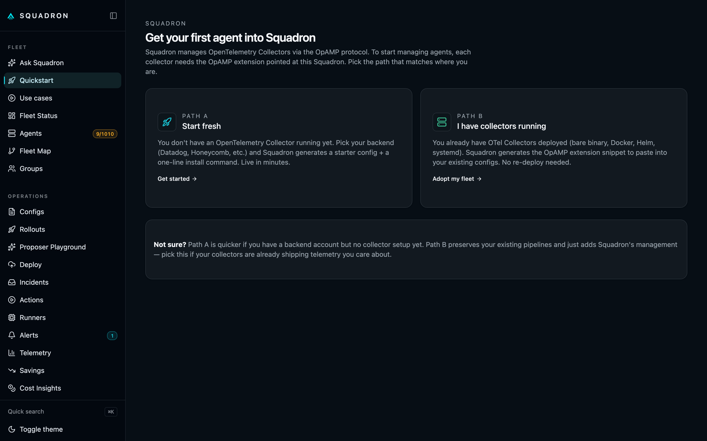
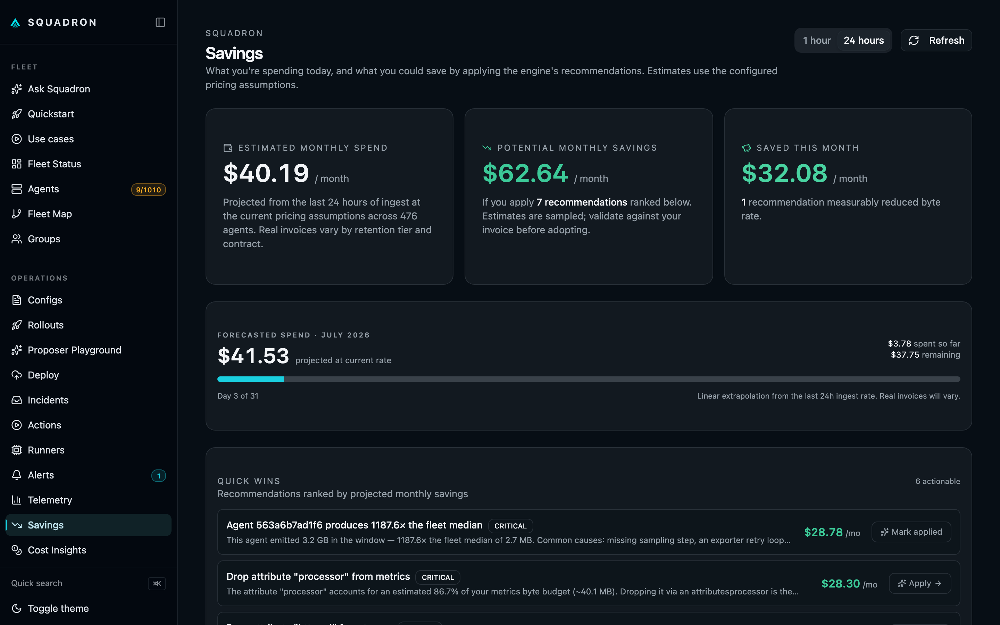
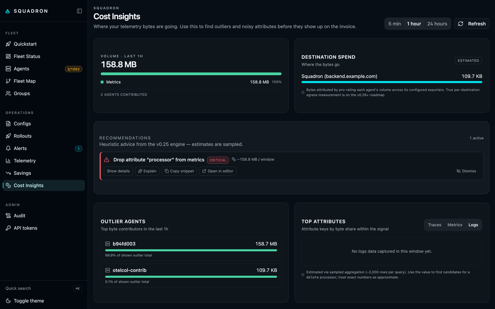
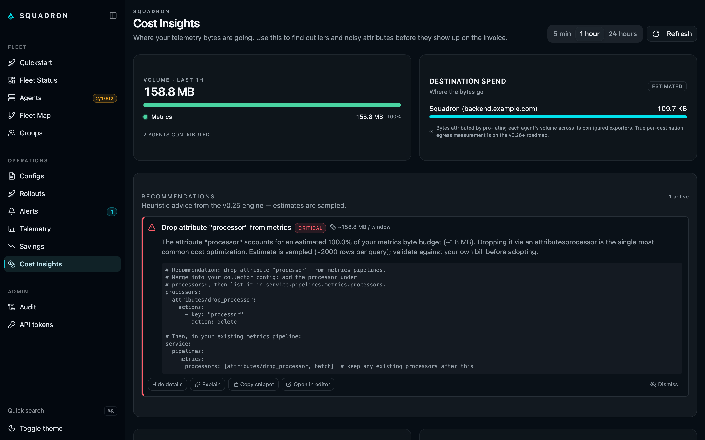
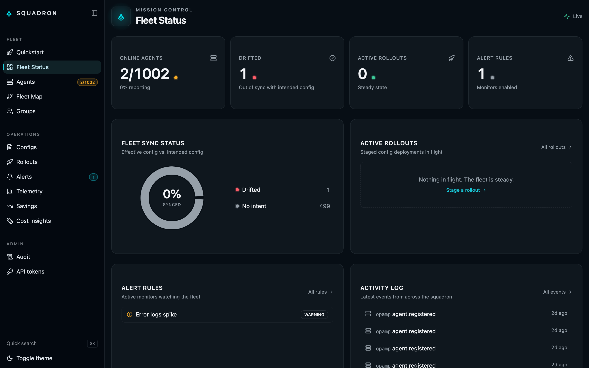
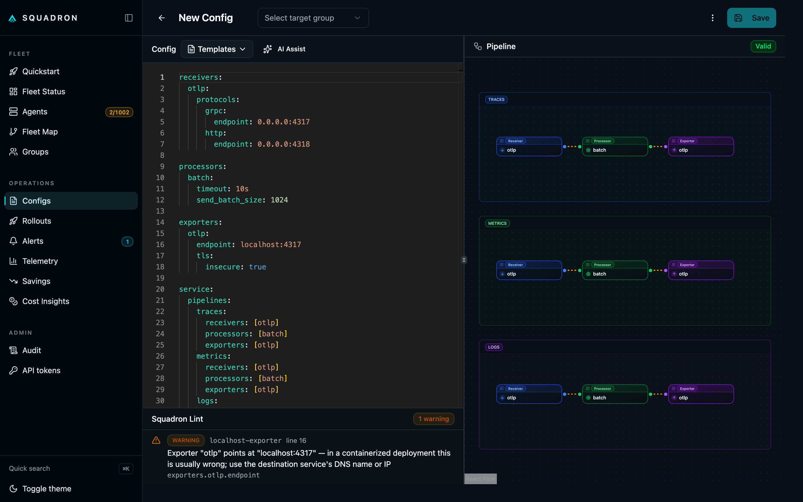
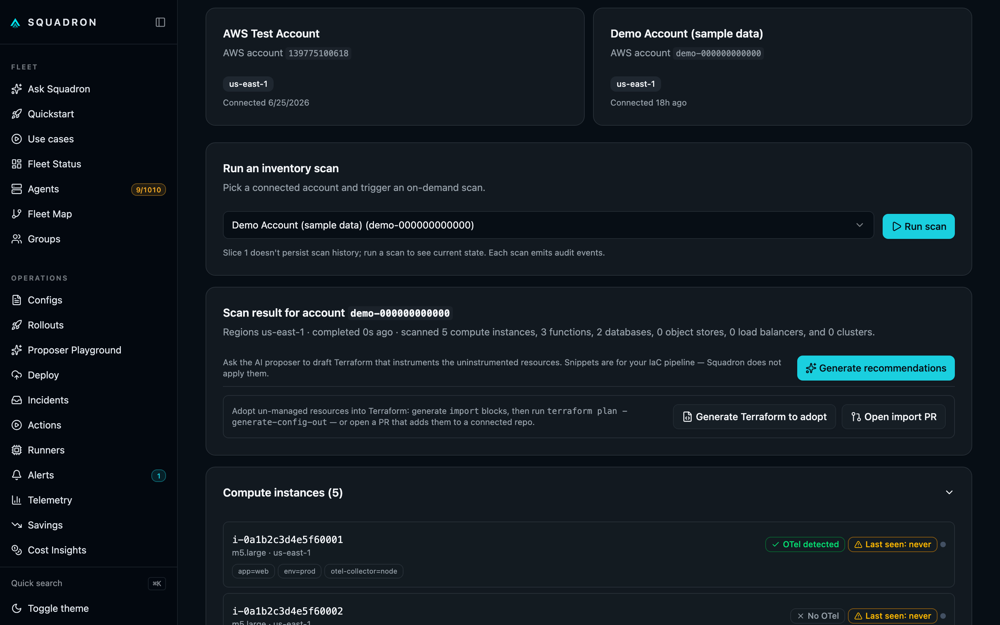
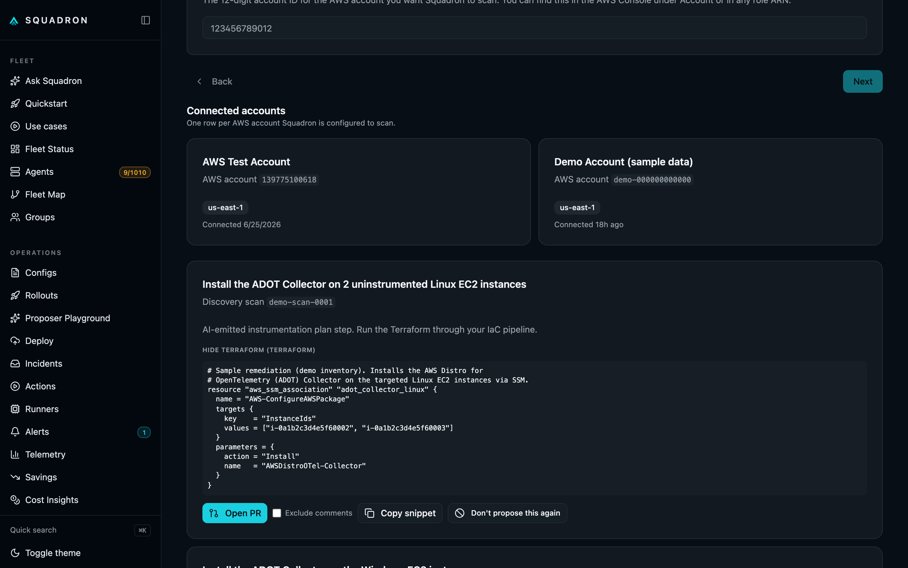
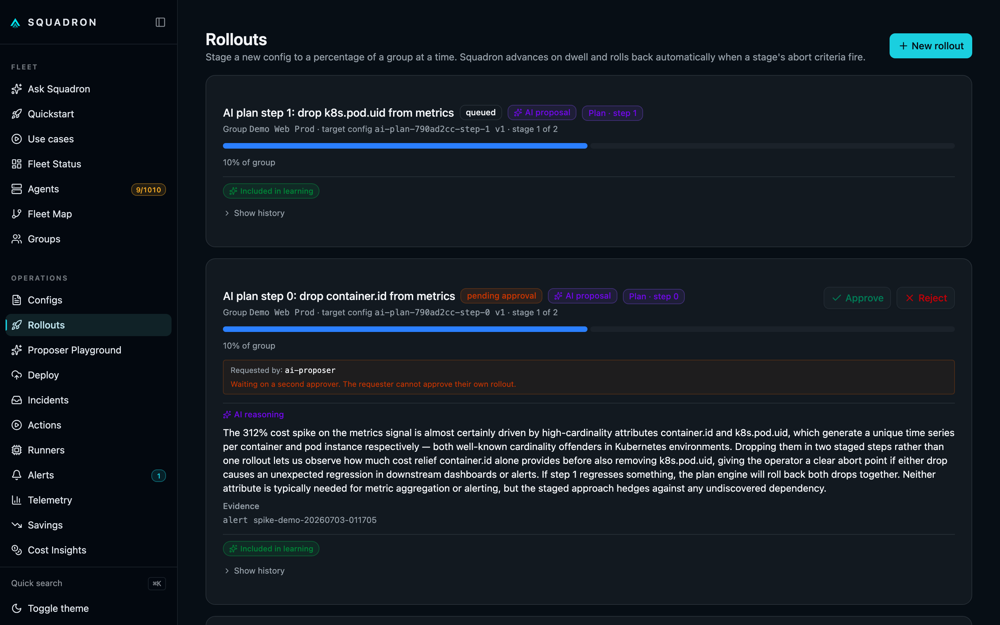
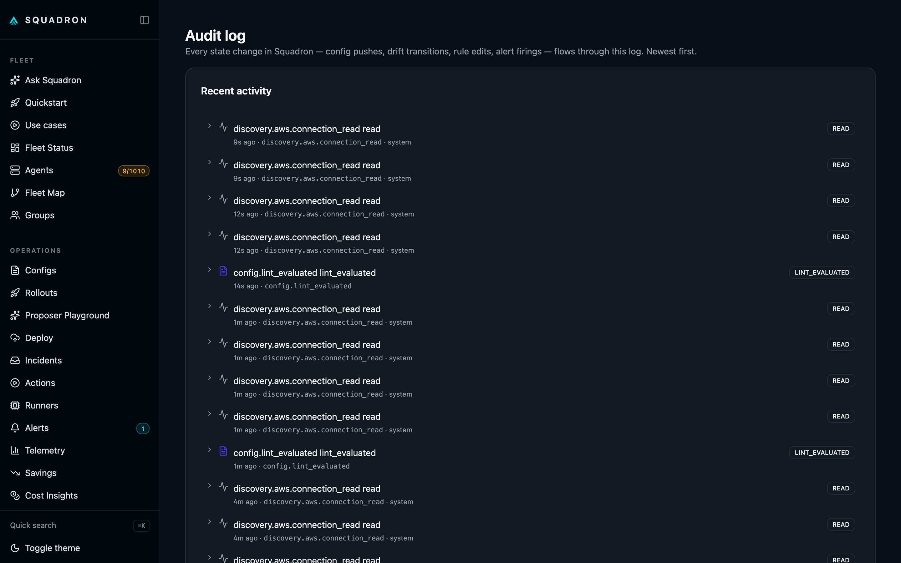

# Squadron

**The open-source OpenTelemetry control plane for coverage, cost,
and safe rollouts.**

Squadron continuously discovers what's running across AWS, GCP,
Azure, and OCI, finds the resources with missing or broken
OpenTelemetry instrumentation, and opens a merge-ready Terraform
pull request that fixes the gap — HCL-aware merged into your
existing config and gated on `terraform validate` before it
reaches you. It also shows where your telemetry bytes are going
and what they cost — in dollars, not megabytes — and ships config
changes through safe, staged rollouts with drift detection and a
full audit trail. AI explains every recommendation in plain
English; you review and merge.

Self-hosted. Free. One Docker command to start — no clone, no build:

```bash
docker run -d -p 8080:8080 -p 4320:4320 -p 4317:4317 -p 4318:4318 \
  -v squadron-data:/app/data ghcr.io/devopsmike2/squadron:latest
open http://localhost:8080/quickstart
```

## See it in action

| | |
|---|---|
| **Quickstart** — fresh install or adopt your existing collectors. | **Savings** — projected $/month spend + recommendations ranked by $ saved. |
|  |  |
| **Cost Insights** — where your bytes are going, by signal, by agent, by attribute. | **Recommendations** — actionable fixes with copy-snippet + apply-via-rollout. |
|  |  |
| **Fleet Status** — live overview of agents, drift, alerts, and recent activity. | **Config Editor** — Monaco-powered with AI Assist + Squadron Lint + live pipeline view. |
|  |  |
| **Discovery** — scan AWS · GCP · Azure · OCI for what's running and what's missing OpenTelemetry (compute, functions, databases). | **AI recommendations** — a merge-ready Terraform fix per gap; review it, then open a PR (or copy the snippet). |
|  |  |
| **Staged rollouts** — deploy config changes in stages with AI reasoning and approval gates; drift is caught and reversible. | **Audit log** — every state change: incidents, drift transitions, alerts, rollouts, approvals. |
|  |  |

> Squadron is a fork of and derivative work based on
> [Lawrence OSS](https://github.com/getlawrence/lawrence-oss),
> licensed under Apache 2.0. See [`NOTICE`](NOTICE) for full
> upstream attribution.

## What you get

**Cost optimization in dollars, not bytes.** The Savings dashboard
projects your $/month spend from observed ingest rates × the
per-GB rates of your backend (Datadog, Honeycomb, etc.). Quick
Wins ranks each recommendation by $ saved with a one-click Apply
that drops you into the config editor with the fix pre-filled.

**AI-assisted config editing.** Click "Explain" on any
recommendation to get a 2-3 sentence summary of what the YAML
fragment does. Open the config editor's "Merge snippet" flow to
have Claude integrate a fix into your existing collector config
— with the merged YAML running through Squadron's existing lint,
diff preview, and staged rollout before reaching production. AI
is off by default; you opt in by setting `ANTHROPIC_API_KEY`.

**Minutes to first agent.** The Quickstart wizard has two paths:
*Start fresh* (pick a backend → get a starter collector config +
Docker/systemd/Helm install command) and *I have collectors
running* (paste the OpAMP snippet into your existing configs +
restart). Bulk mode generates one ssh-ready one-liner per host
for fleet adoption.

**Safe rollouts with auto-abort.** Stages (percent or
label-based), per-stage dwell, abort criteria (drift, drop rate,
error logs, exporter errors). Pause/resume, webhook notifications,
trace-instrumented engine. The grown-up deployment story shipped
as OSS.

**Modern UX.** Fleet Map with pipeline/dataflow/topology tabs,
real-time Cost Insights, ⌘K command palette, keyboard shortcuts,
saved filters, dark/light theme audit. Most competitors run on
2018-era admin UIs.

**Self-instrumented.** Squadron's own audit events, rollout
engine, alert evaluator, and AI service emit OpenTelemetry traces.
Bridges its Prometheus `/metrics` surface to OTLP. Debug Squadron
with the same tools you debug everything else with.

## Who Squadron is for

You're probably a fit if:

- You're 1–3 engineers running OpenTelemetry collectors and
  paying a SaaS observability vendor (Datadog, Honeycomb, New
  Relic, Grafana Cloud, SigNoz, or similar).
- The telemetry bill has gotten everyone's attention.
- You don't have a dedicated observability team to tune the
  pipelines, and you'd rather ship product than read the OTel
  spec.
- You want a tool that works after `docker compose up`, not after
  a sales call and a multi-week integration.

You're probably **not** the target operator if:

- You're running multi-thousand-agent fleets with multi-region
  HA + SOC 2 + mandatory SSO requirements. Look at Bindplane Cloud
  or Grafana Fleet Management.
- You don't use OpenTelemetry. (We don't translate from Fluentd,
  Logstash, or vendor-specific agents.)
- You want a single tool to be both your control plane AND your
  telemetry backend. Squadron does the first job; the second is
  better handled by Honeycomb / Datadog / Tempo / Loki / Mimir.

## Quick start

Fastest — no clone, one command:

```bash
curl -fsSL https://raw.githubusercontent.com/devopsmike2/squadron/main/install.sh | sh
```

This fetches a standalone compose into `./squadron`, starts it, waits for
health, and prints the dashboard URL. To inspect before running, grab just
the compose file:

```bash
curl -fsSL https://raw.githubusercontent.com/devopsmike2/squadron/main/deploy/docker-compose.yml -o docker-compose.yml
docker compose up -d
```

Already running and want a quick check? `./scripts/doctor.sh` verifies
Docker, ports, and health, and prints the dashboard URL.

Prefer to clone? `docker compose up -d` runs the same published image
plus a demo collector, so the dashboard lands with a live agent already
connected:

```bash
git clone https://github.com/devopsmike2/squadron.git
cd squadron
docker compose up -d
open http://localhost:8080/quickstart
```

The Quickstart wizard takes it from there: pick your backend
(or paste the OpAMP snippet into an existing collector config),
follow the install command, watch the dashboard light up when
your first agent connects.

Want to enable the AI features? Add your Anthropic API key:

```bash
echo "ANTHROPIC_API_KEY=sk-ant-..." >> .env
docker compose restart squadron
```

The AI buttons appear in the UI as soon as `/api/v1/ai/status`
sees the key.

### Explore cloud discovery without a cloud account

Squadron's cloud discovery — inventory plus instrumentation-gap
recommendations — normally needs a connected AWS / GCP / Azure / OCI
account. To try it with zero credentials, open **any** of the four cloud
pages under Discovery (AWS, GCP, Azure, or OCI) and click **Try the demo**.
Squadron loads a built-in sample inventory for that cloud — a mix of
instrumented and uninstrumented compute and databases — and generates the
matching Terraform recommendations, with no cloud account, no API key, and
no cloud calls. Remove it any time from the connection list.

## The Squadron stack

Squadron runs as a single process composed of:

- **OpAMP server** on port `4320` — manages collectors via
  WebSocket, distributes configurations, tracks status and
  capabilities.
- **OTLP receiver** on ports `4317`/`4318` — accepts traces,
  metrics, and logs over gRPC and HTTP. A bounded worker pool
  parses + enriches + persists.
- **REST + UI** on port `8080` — Gin-based JSON API, embedded
  React UI, Prometheus `/metrics` surface.
- **Storage** — SQLite for application data (agents, groups,
  configs, audit, dismissals), DuckDB for telemetry + rollups.
- **CLI** — `squadronctl` for CI scripting + management
  automation.

Optional: enable `ai.enabled` + `pricing.enabled` in
`squadron.yaml` for the cost + AI features.

## Documentation

Full docs under [`/docs`](./docs/README.md):

**Start here**
- [Quickstart](./docs/quickstart.md) — the wizard flow walked
  through in detail
- [Getting started](./docs/getting-started.md) — installing,
  connecting your first collector
- [Deployment guide](./docs/deployment.md) — the 4 deployment
  shapes (single VM, Compose, Kubernetes, OpenShift), required
  vs optional components, production checklist
- [Concepts](./docs/concepts.md) — agents, groups, configs, drift

**Save money**
- [Savings](./docs/savings.md) — dollar projections, pricing
  rules, Quick Wins
- [Recommendations](./docs/recommendations.md) — the four v0.25
  recipes + how to add new ones
- [AI assist](./docs/ai-assist.md) — Explain + Merge + what gets
  sent to Anthropic + cost shape

**Manage your fleet**
- [Rollouts](./docs/rollouts.md) — staged deploys, abort
  criteria, preview/diff, recipes, templates
- [Alerts](./docs/alerts.md) — threshold rules over fleet state
  + webhooks
- [Audit log](./docs/audit-log.md) — every state change,
  filterable
- [Authentication](./docs/auth.md) — Bearer tokens, scopes,
  expiration
- [Operating Squadron](./docs/operating.md) — env vars, prod
  checklist, backup, upgrade

**Reference**
- [Scale testing](./docs/scale-testing.md) — fleetsim, 1000-agent
  numbers, perf gates
- [Self-monitoring](./docs/self-monitoring.md) — Squadron's own
  OTel traces
- [squadronctl CLI](./docs/squadronctl.md) — command-line client
- [API reference](./docs/api-reference.md) — REST endpoints
- [What's OSS vs Enterprise](./docs/oss-vs-enterprise.md) — what's
  free forever vs the planned commercial tier
- [Detection coverage](./docs/detection-coverage.md) — exactly
  which signals are real vs proxy vs deferred, per cloud
- [Self-hosting security](./docs/security-self-hosting.md) — turn
  auth on, what data leaves the box, credentials

## How Squadron compares

Honest, audience-specific notes — see
[`docs/positioning.md`](./docs/positioning.md) for the longer
version.

**vs Bindplane.** Bindplane is the mature enterprise option —
better at 10k+ agent scale, formal compliance, larger curated
processor library. Squadron is the OSS-first SMB option —
AI-assisted, cost-first, modern UX, minutes to set up. Small
team with a painful telemetry bill → probably Squadron. Enterprise
RFP → probably Bindplane.

**vs Grafana Fleet Management.** Grafana Fleet is great if you're
already deep in Grafana Cloud / Loki / Tempo / Mimir and use
Alloy. Squadron is standalone, OTel-first, and doesn't pull you
into a broader ecosystem. We complement Grafana on the
control-plane side rather than competing on telemetry storage.

**vs Datadog Observability Pipelines / Cribl.** Those are
Vector/Cribl-based and shine on data transformation and routing.
Squadron is OTel-native and shines on cost analysis + AI-assisted
config editing for OpenTelemetry collectors specifically. Use
Cribl/DD-Pipelines if your needs are "complex routing across many
non-OTel sources". Use Squadron if you're standardized on OTel
and want the OTel-specific cost story.

## Known limitations

We're upfront about where Squadron is deep and where it isn't —
lead with this when you evaluate it:

- **Detection coverage is not uniform across tiers/clouds.** Some
  observability axes are real metric-backed detection; others are
  proxy-based or honestly deferred. The authoritative matrix is
  [detection coverage](./docs/detection-coverage.md). Notably, AWS
  Lambda and Azure Functions cold-start detection need paid
  telemetry layers (Lambda Insights / Application Insights), and OCI
  queue poison-rate has no native metric — these are flagged, not
  silently wrong.
- **Cost projections are directional.** Dollar figures come from
  observed ingest × the per-GB backend rates you configure; validate
  against your real invoice before acting.
- **AI is opt-in, bring-your-own-key.** Recommendations, Explain,
  Merge, and incident drafting require `ANTHROPIC_API_KEY`; with no
  key they're simply off. The deterministic Terraform snippets are
  correctness-audited, but free-form LLM reasoning should be reviewed
  before you merge — which is the design: every fix is a PR gated by
  your review + CI.
- **Single-instance, single-team in OSS.** Multi-tenancy, SSO/RBAC,
  HA, and long-term audit retention are
  [commercial-tier](./docs/oss-vs-enterprise.md) concerns.

## Project status

Squadron is in active development. The OSS core under Apache 2.0
is free for any size fleet and self-hostable forever. A future
commercial tier will target enterprise concerns (multi-tenancy,
HA, SSO/RBAC depth, audit retention SLAs, priority support) — the
SMB experience stays free. See [what's OSS vs Enterprise](./docs/oss-vs-enterprise.md).

Release tags so far:

- `v0.27.1` — Quickstart wizard (fresh install + adopt existing)
- `v0.27.0` — Savings dashboard ($/month projection)
- `v0.26.0` — AI assist (Explain + Merge)
- `v0.25.0` — Cost recommendations engine
- `v0.24.0` — Telemetry volume insights
- earlier — rollouts, alerts, audit log, OpAMP, OTel
  instrumentation, fleet UI redesign

## Development

The dev stack runs the Go backend with hot reload via
[Air](https://github.com/air-verse/air) and the Vite UI dev
server side by side. It builds from source, so use the dev
compose file explicitly:

```bash
docker compose -f docker-compose.dev.yml up
docker compose -f docker-compose.dev.yml logs -f squadron

# UI dev server on http://localhost:5173, API on http://localhost:8080
```

Local without Docker (requires Go 1.24+, GCC/G++, SQLite dev
libraries):

```bash
go install github.com/air-verse/air@latest
make dev
```

See [`CONTRIBUTING.md`](CONTRIBUTING.md) for the full contribution
guide.

## Community & Support

- **Questions / ideas:** [GitHub Discussions](https://github.com/devopsmike2/squadron/discussions).
- **Bugs:** open a [bug report](https://github.com/devopsmike2/squadron/issues/new?template=bug_report.yml).
- **Feature requests:** open a [feature request](https://github.com/devopsmike2/squadron/issues/new?template=feature_request.yml).
- **Security:** report privately per [SECURITY.md](SECURITY.md) — please don't file a public issue.
- **Contributing:** see [CONTRIBUTING.md](CONTRIBUTING.md) (commits need a DCO `Signed-off-by`, added by `git commit -s`).
- All participation is governed by our [Code of Conduct](CODE_OF_CONDUCT.md).

More help routing in [SUPPORT.md](SUPPORT.md).

## License

Apache 2.0. See [`LICENSE`](LICENSE) and [`NOTICE`](NOTICE).
