<div align="center">


# Squadron

**The open-source control plane for your OpenTelemetry collector fleet.**

[Documentation](https://devopsmike2.github.io/squadron/) &middot; [Getting started](https://devopsmike2.github.io/squadron/getting-started/) &middot; [How it works](https://devopsmike2.github.io/squadron/how-it-works/) &middot; [Enterprise](https://devopsmike2.github.io/squadron/enterprise/overview/)

</div>

Squadron is one place to see every collector in your fleet, change
its config safely, catch drift before it pages you, and keep the
whole fleet healthy — with a governed change loop and a
tamper-evident audit trail behind every move.

**Squadron sits between your agents and your observability
backend — it is not another place your telemetry lands.** Your
data keeps flowing to Grafana, Prometheus, Mimir, Loki, Tempo, or
Datadog exactly as it does today. Squadron manages the fleet that
feeds them: the collectors, their config, their drift, their
health. It's a **control plane, not a data plane.**

That's the gap it fills. Observability tools own the *data*. IaC
tools own *provisioning*. Nobody owns the question in between — *is
my collector fleet configured safely, is it drifting, is it
actually healthy?* That's Squadron.

<!-- LinkedIn narrated videos: embed via GitHub user-attachments URLs (BlindSpots, ProveIt) -->

Self-hosted. Free. One Docker command to start — no clone, no build:

```bash
docker run -d -p 8080:8080 -p 4320:4320 -p 4317:4317 -p 4318:4318 \
  -v squadron-data:/app/data ghcr.io/devopsmike2/squadron:latest
open http://localhost:8080/quickstart
```

## See it in action

**Fleet Status** — the control plane's home view: every collector,
its health, drift, alerts, and recent activity, updating live.

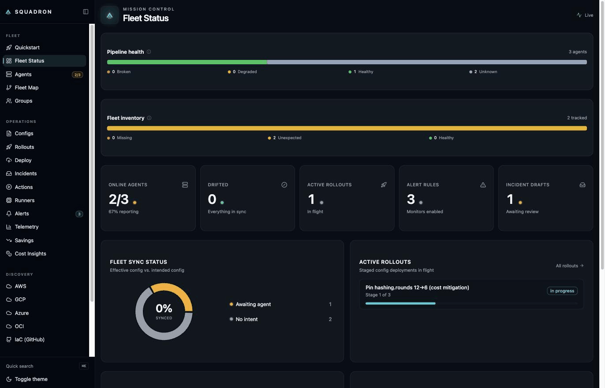

More screens — the Fleet Map, per-agent drift, and groups — appear
next to the capabilities they belong to below.

## The core loop

A control plane is only as trustworthy as the way it changes
things. Squadron's is one governed change loop — every config
change to your OTel fleet moves through the same stages, and
nothing skips them:

**Discover / Propose → Validate → Approve → Rollout → Verify.**

- **Discover / Propose.** Multi-cloud discovery and the cost
  engine surface gaps and overspend; AI drafts the fix as a
  merge-ready Terraform PR (for cloud instrumentation) or a
  collector-config change (for the fleet).
- **Validate.** Terraform fixes are HCL-aware merged and gated on
  `terraform validate`; collector configs run through Squadron
  Lint and a diff preview before anything ships.
- **Approve.** Groups can require **N-of-M approvals** with
  rule-based approver roles; rollbacks can carry their own
  approval policy. Nothing rolls out unreviewed.
- **Rollout.** Staged deploys (percent or label) with per-stage
  dwell and **auto-abort** on drift, drop-rate, or exporter
  errors — pausable, resumable, and reversible. Multiple changes
  can be grouped into a single **plan** under one approval and one
  audit arc.
- **Verify.** Drift detection, per-agent **Pipeline Health**, and
  a **tamper-evident, hash-chained audit log** with an offline
  verifier record and prove exactly what happened.

Every step above ships in OSS. AI is opt-in (bring your own
`ANTHROPIC_API_KEY`); with no key, the AI-authored steps are
simply off and the deterministic loop still runs.

## More screens

A wider tour of the control plane — cost, config, discovery,
rollouts, and audit:

| | |
|---|---|
| **Quickstart** — fresh install or adopt your existing collectors. | **Savings** — projected $/month spend + recommendations ranked by $ saved. |
| 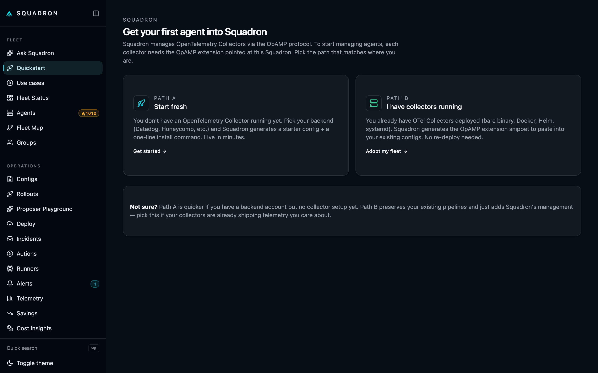 | 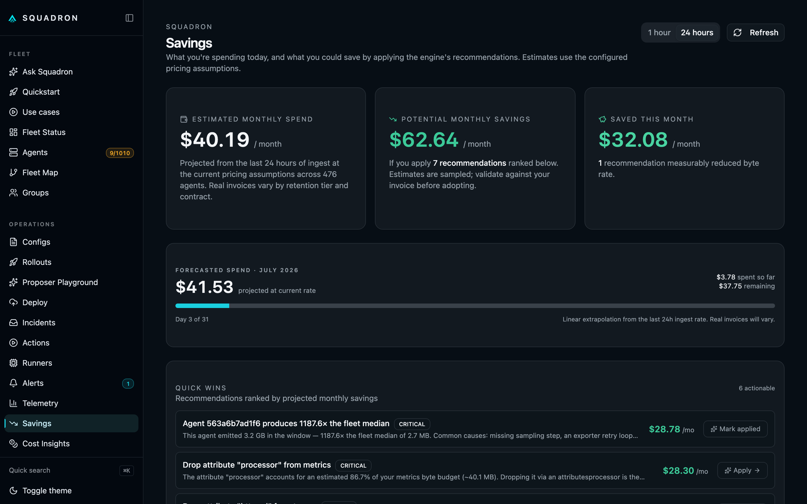 |
| **Cost Insights** — where your bytes are going, by signal, by agent, by attribute. | **Recommendations** — actionable fixes with copy-snippet + apply-via-rollout. |
| 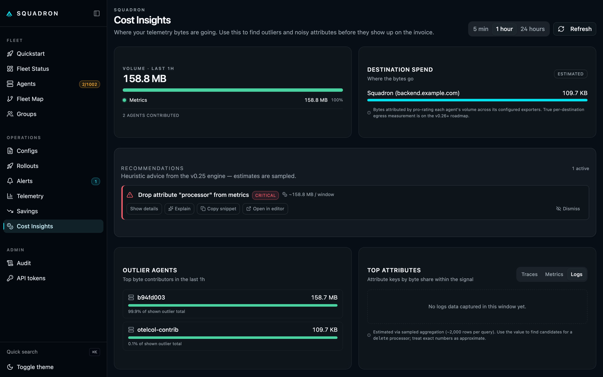 | 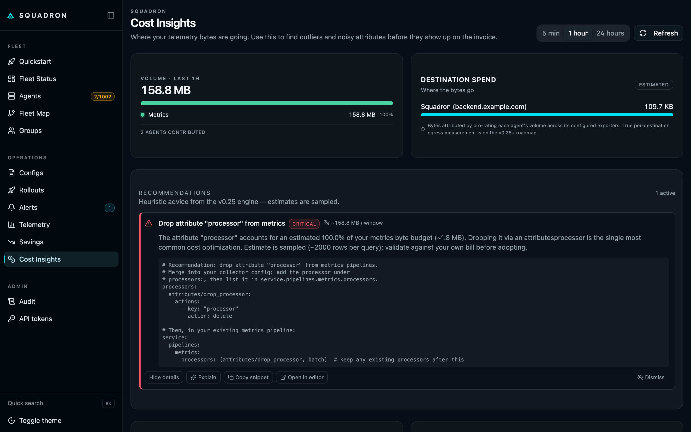 |
| **Config Editor** — Monaco-powered with AI Assist + Squadron Lint + live pipeline view. | **Discovery** — scan AWS · GCP · Azure · OCI for what's running and what's missing OpenTelemetry (compute, functions, databases). |
| 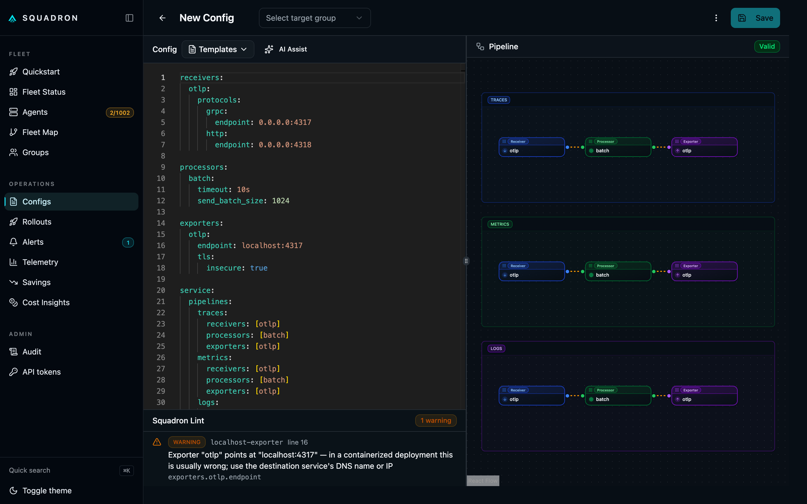 | 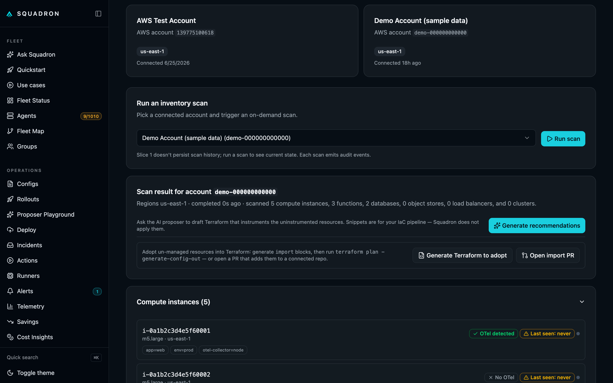 |
| **AI recommendations** — a merge-ready Terraform fix per gap; review it, then open a PR (or copy the snippet). | **Staged rollouts** — deploy config changes in stages with AI reasoning and approval gates; drift is caught and reversible. |
| 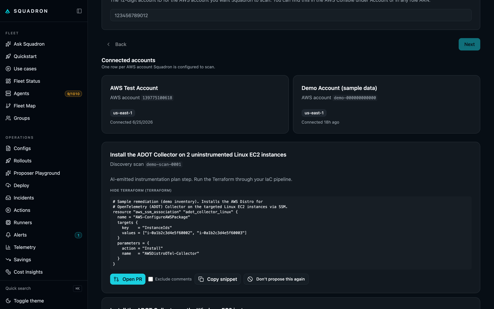 | 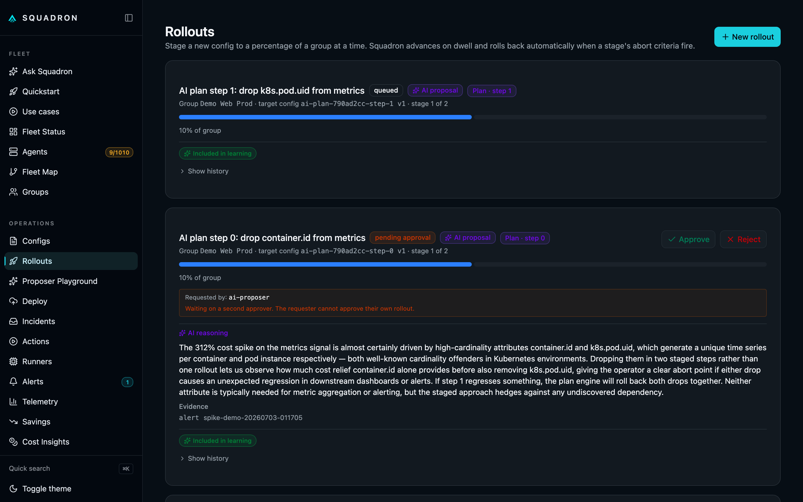 |
| **Audit log** — every state change: incidents, drift transitions, alerts, rollouts, approvals — hash-chained and verifiable. | |
| 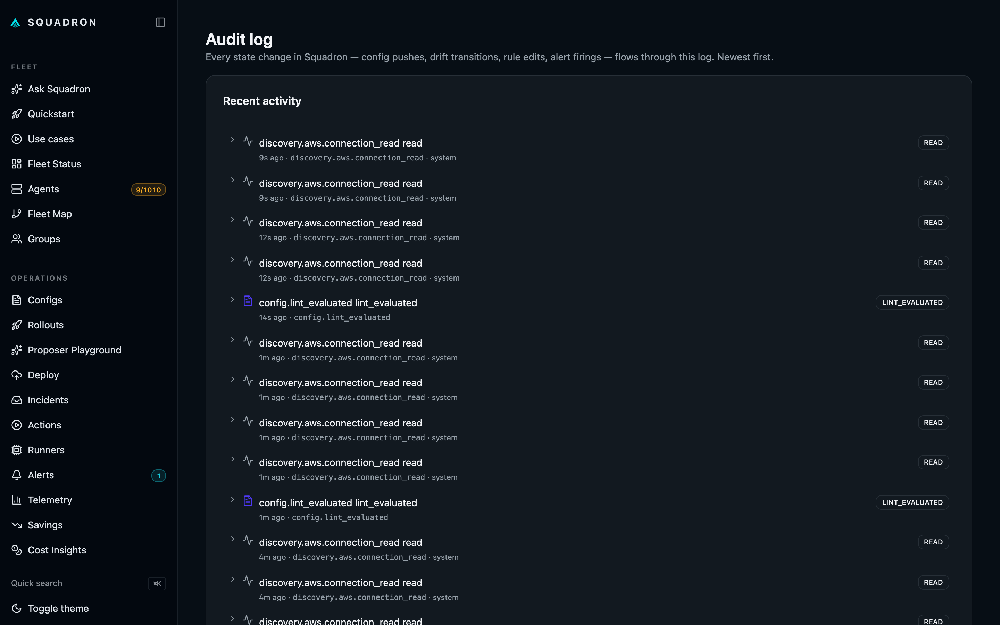 | |

> Squadron is a fork of and derivative work based on
> [Lawrence OSS](https://github.com/getlawrence/lawrence-oss),
> licensed under Apache 2.0. See [`NOTICE`](NOTICE) for full
> upstream attribution.

## What you get

Everything below is a capability of the control plane — ways to
see the fleet, change it safely, and prove what happened. None of
it moves your telemetry off its existing path to your backend.

**Multi-cloud discovery → AI PR.** Connect a cloud read-only
(AWS, GCP, Azure, or OCI) and Squadron inventories compute,
databases, Kubernetes, serverless, object stores, load balancers,
and event sources, flags what's un- or under-instrumented, and
opens a **merge-ready Terraform PR** against your IaC repo —
HCL-aware merged, `terraform validate`-gated, with verdict
learning (a decline teaches the next scan). It also generates
`env → Terraform` import blocks for un-managed resources. This is
the most battle-tested path in the product. No cloud account? Open
any Discovery page and click **Try the demo** for a built-in
sample inventory across all four clouds — no credentials, no cloud
calls.

**Cost optimization in dollars, not bytes.** The Savings dashboard
projects your $/month spend from observed ingest rates × the
per-GB rates of your backend (Datadog, Honeycomb, etc.). Quick
Wins ranks each recommendation by $ saved with a one-click Apply
that drops you into the config editor with the fix pre-filled.

**OpAMP fleet management.** Collectors register over OpAMP
(port `4320`), report status, capabilities, and effective config,
and show live on the Fleet Map with pipeline / data-flow /
topology views. Passive OTLP discovery means any standard
collector pointed at Squadron registers itself — even without a
UUID `service.instance.id`.

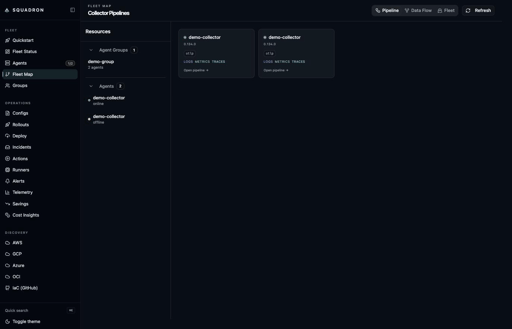

**Pipeline Health from collector self-metrics.** Squadron reads
the collector's built-in `otelcol_*` self-metrics — no extra
agents, no sidecars, no scraping infra — and gives every agent a
verdict (`healthy` / `degraded` / `broken` / `unknown`) with a
plain-English signal list (queue 92% full, `send_failed > 0`,
processor dropping points), plus a fleet-level stacked-bar summary
and top offenders. This answers the first question an SRE asks:
"are my collectors actually delivering data?"

The per-agent view surfaces each collector's effective config,
health signals, and drift from its intended config:

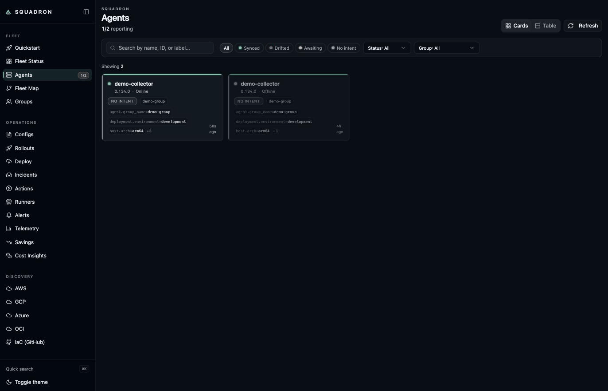

**AI-assisted config editing.** Click "Explain" on any
recommendation to get a 2–3 sentence summary of what a YAML
fragment does. Open the config editor's "Merge snippet" flow to
have the model integrate a fix into your existing collector config
— running through Squadron's lint, diff preview, and staged
rollout before it reaches production. For cost spikes the proposer
can emit a whole **multi-step plan** (progressive attribute drop,
sample-rate ratchet, pipeline split, dual-write-then-cut) as a
single approvable, reversible arc. AI is off by default; you opt
in by setting `ANTHROPIC_API_KEY`.

**Safe rollouts with approvals and auto-abort.** Stages (percent
or label-based), per-stage dwell, abort criteria (drift, drop
rate, error logs, exporter errors), pause/resume, webhook
notifications, trace-instrumented engine — plus **N-of-M
approvals** with rule-based approver roles and per-group rollback
policy. The grown-up deployment story, shipped as OSS.

Groups are how you slice the fleet — by environment, team, or
label — so config and approval policy apply to the right
collectors:

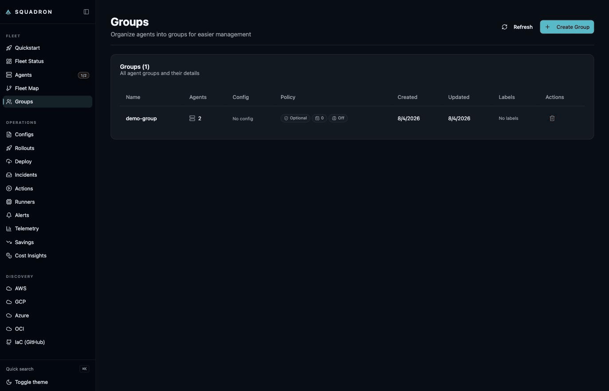

**Tamper-evident audit + offline verifier.** The audit log is a
per-tenant **hash chain**: every state change (incidents, drift
transitions, alerts, rollouts, approvals) links to the previous
one, and Squadron can self-verify the chain. The bundled
`squadron-audit-verify` CLI lets an auditor re-verify an exported
chain **offline, with zero secrets** — re-hash the rows, confirm
the tip matches the attestation. An in-UI Integrity panel surfaces
the result.

**Optional action runner.** An opt-in, separately deployed
component (`squadron-action-runner`) that executes a narrow,
allowlisted set of actions — `restart-k8s-workload`,
`restart-docker`, `restart-systemd`, `run-shell` (allowlist) —
where every request is Ed25519-signed by Squadron and verified by
the runner before it runs. Ships as a standalone image; wiring it
into rollout plans is on the roadmap.

**Modern UX.** Fleet Map with pipeline / data-flow / topology
tabs, real-time Cost Insights, ⌘K command palette, keyboard
shortcuts, saved filters, dark/light theme. Sidebar navigation is
grouped by SRE job, not internal plumbing.

**Self-instrumented.** Squadron's own audit events, rollout
engine, alert evaluator, and AI service emit OpenTelemetry traces,
and it bridges its Prometheus `/metrics` surface to OTLP. Debug
Squadron with the same tools you debug everything else with.

## Who Squadron is for

You're probably a fit if:

- You're 1–3 engineers running OpenTelemetry collectors and
  paying a SaaS observability vendor (Datadog, Honeycomb, New
  Relic, Grafana Cloud, SigNoz, or similar).
- The telemetry bill has gotten everyone's attention.
- You don't have a dedicated observability team to tune the
  pipelines, and you'd rather ship product than read the OTel
  spec.
- You want a tool that works after `docker compose up`, not after
  a sales call and a multi-week integration.

You're probably **not** the target operator if:

- You're running multi-thousand-agent fleets with multi-region
  HA + SOC 2 + mandatory SSO requirements. Look at Bindplane Cloud
  or Grafana Fleet Management.
- You don't use OpenTelemetry. (We don't translate from Fluentd,
  Logstash, or vendor-specific agents.)
- You want a single tool to be both your control plane AND your
  telemetry backend. Squadron does the first job; the second is
  better handled by Honeycomb / Datadog / Tempo / Loki / Mimir.

## Quick start

Fastest — no clone, one command:

```bash
curl -fsSL https://raw.githubusercontent.com/devopsmike2/squadron/main/install.sh | sh
```

This fetches a standalone compose into `./squadron`, starts it, waits for
health, and prints the dashboard URL. To inspect before running, grab just
the compose file:

```bash
curl -fsSL https://raw.githubusercontent.com/devopsmike2/squadron/main/deploy/docker-compose.yml -o docker-compose.yml
docker compose up -d
```

Already running and want a quick check? `./scripts/doctor.sh` verifies
Docker, ports, and health, and prints the dashboard URL.

Prefer to clone? `docker compose up -d` runs the same published image
plus a demo collector, so the dashboard lands with a live agent already
connected:

```bash
git clone https://github.com/devopsmike2/squadron.git
cd squadron
docker compose up -d
open http://localhost:8080/quickstart
```

The Quickstart wizard takes it from there: pick your backend
(or paste the OpAMP snippet into an existing collector config),
follow the install command, watch the dashboard light up when
your first agent connects.

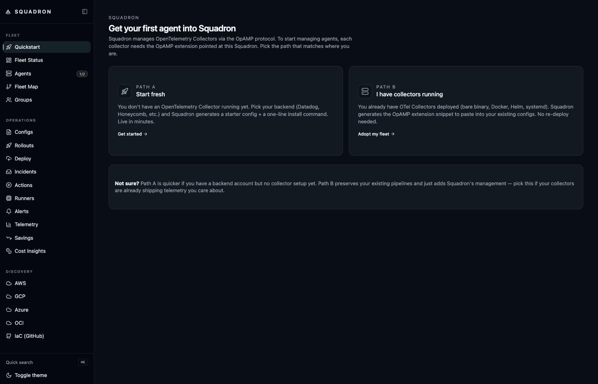

Want to enable the AI features? Add your Anthropic API key:

```bash
echo "ANTHROPIC_API_KEY=sk-ant-..." >> .env
docker compose restart squadron
```

The AI buttons appear in the UI as soon as `/api/v1/ai/status`
sees the key.

### Explore cloud discovery without a cloud account

Squadron's cloud discovery — inventory plus instrumentation-gap
recommendations — normally needs a connected AWS / GCP / Azure / OCI
account. To try it with zero credentials, open **any** of the four cloud
pages under Discovery (AWS, GCP, Azure, or OCI) and click **Try the demo**.
Squadron loads a built-in sample inventory for that cloud — a mix of
instrumented and uninstrumented compute and databases — and generates the
matching Terraform recommendations, with no cloud account, no API key, and
no cloud calls. Remove it any time from the connection list.

## The Squadron stack

Squadron runs as a single process composed of:

- **OpAMP server** on port `4320` — manages collectors via
  WebSocket, distributes configurations, tracks status, effective
  config, and capabilities.
- **OTLP receiver** on ports `4317`/`4318` — accepts traces,
  metrics, and logs over gRPC and HTTP. A bounded worker pool
  parses + enriches + persists.
- **REST + UI** on port `8080` — Gin-based JSON API, embedded
  React UI, Prometheus `/metrics` surface.
- **Storage** — SQLite for application data (agents, groups,
  configs, audit, dismissals), DuckDB for telemetry + rollups.
  An external Postgres backend for larger/HA deployments is in
  progress.
- **CLI** — `squadronctl` for CI scripting + management
  automation; `squadron-audit-verify` for offline audit
  attestation.

Optional: enable `ai.enabled` + `pricing.enabled` in
`squadron.yaml` for the cost + AI features. The optional
`squadron-action-runner` is deployed separately.

## What's OSS vs Enterprise

Squadron is **open core**. The principle: **breadth and the core
loop are OSS and free for any fleet size; depth, scale,
governance, and support are the future commercial tier.** The
boundary is a **build-time** seam — the open core compiles no-op
providers and the enterprise edition supplies the real ones, so an
OSS binary can't be flipped into an enterprise one with a config
flag. Confirm the edition of any running instance via the
`squadron_build_info{edition=...}` metric.

**Free forever in OSS:** multi-cloud discovery + AI Terraform PRs,
OpAMP fleet management, staged rollouts with N-of-M approvals,
multi-step plans, drift detection, Pipeline Health, Cost Insights
+ Savings, alerts, incident drafting, the tamper-evident
hash-chain audit log + offline verifier, single-tenant audit
CSV/JSON export, Bearer-token auth + scopes, the action runner.

**Reserved for the commercial tier** (inert 404 / no-op seams in
this tree): SSO (SAML/OIDC) + SCIM + full RBAC, multi-team /
multi-tenancy isolation, cross-tenant compliance audit export +
access reviews, long-term tamper-evident audit **retention** SLAs,
per-tenant usage/billing (chargeback/showback) and differentiated
budgets, add-on-backed detectors (AWS Lambda Insights / Azure
Application Insights), clustered/HA control plane at 10k+ agents,
air-gapped / BYO-LLM deployment, and support SLAs.

Full detail: [what's OSS vs Enterprise](./docs/oss-vs-enterprise.md).

## Documentation

Full docs under [`/docs`](./docs/README.md):

**Start here**
- [Quickstart](./docs/quickstart.md) — the wizard flow walked
  through in detail
- [Getting started](./docs/getting-started.md) — installing,
  connecting your first collector
- [Deployment guide](./docs/deployment.md) — the 4 deployment
  shapes (single VM, Compose, Kubernetes, OpenShift), required
  vs optional components, production checklist
- [Concepts](./docs/concepts.md) — agents, groups, configs, drift

**Save money**
- [Savings](./docs/savings.md) — dollar projections, pricing
  rules, Quick Wins
- [Recommendations](./docs/recommendations.md) — the cost recipes
  + how to add new ones
- [AI assist](./docs/ai-assist.md) — Explain + Merge + what gets
  sent to Anthropic + cost shape

**Manage your fleet**
- [Rollouts](./docs/rollouts.md) — staged deploys, N-of-M
  approvals, abort criteria, preview/diff, multi-step plans
- [Pipeline Health](./docs/pipeline-health.md) — per-agent
  verdicts from collector self-metrics
- [Alerts](./docs/alerts.md) — threshold rules over fleet state
  + webhooks
- [Audit log](./docs/audit-log.md) — every state change,
  filterable; hash-chain integrity + offline verifier
- [Authentication](./docs/auth.md) — Bearer tokens, scopes,
  expiration
- [Operating Squadron](./docs/operating.md) — env vars, prod
  checklist, backup, upgrade

**Reference**
- [Scale testing](./docs/scale-testing.md) — fleetsim, 1000-agent
  numbers, perf gates
- [Self-monitoring](./docs/self-monitoring.md) — Squadron's own
  OTel traces
- [squadronctl CLI](./docs/squadronctl.md) — command-line client
- [API reference](./docs/api-reference.md) — REST endpoints
- [What's OSS vs Enterprise](./docs/oss-vs-enterprise.md) — what's
  free forever vs the planned commercial tier
- [Detection coverage](./docs/detection-coverage.md) — exactly
  which signals are real vs proxy vs deferred, per cloud
- [Self-hosting security](./docs/security-self-hosting.md) — turn
  auth on, what data leaves the box, credentials

## How Squadron compares

Honest, audience-specific notes — see
[`docs/positioning.md`](./docs/positioning.md) for the longer
version.

**vs Bindplane.** Bindplane is the mature enterprise option —
better at 10k+ agent scale, formal compliance, larger curated
processor library. Squadron is the OSS-first SMB option —
AI-assisted, cost-first, modern UX, minutes to set up. Small
team with a painful telemetry bill → probably Squadron. Enterprise
RFP → probably Bindplane.

**vs Grafana Fleet Management.** Grafana Fleet is great if you're
already deep in Grafana Cloud / Loki / Tempo / Mimir and use
Alloy. Squadron is standalone, OTel-first, and doesn't pull you
into a broader ecosystem. We complement Grafana on the
control-plane side rather than competing on telemetry storage.

**vs Datadog Observability Pipelines / Cribl.** Those are
Vector/Cribl-based and shine on data transformation and routing.
Squadron is OTel-native and shines on cost analysis + AI-assisted
config editing for OpenTelemetry collectors specifically. Use
Cribl/DD-Pipelines if your needs are "complex routing across many
non-OTel sources". Use Squadron if you're standardized on OTel
and want the OTel-specific cost story.

## Known limitations

We're upfront about where Squadron is deep and where it isn't —
lead with this when you evaluate it:

- **Detection coverage is not uniform across tiers/clouds.** Some
  observability axes are real metric-backed detection; others are
  proxy-based or honestly deferred. The authoritative matrix is
  [detection coverage](./docs/detection-coverage.md). Notably, AWS
  Lambda and Azure Functions cold-start detection need paid
  telemetry layers (Lambda Insights / Application Insights), and OCI
  queue poison-rate has no native metric — these are flagged, not
  silently wrong.
- **Cost projections are directional.** Dollar figures come from
  observed ingest × the per-GB backend rates you configure; validate
  against your real invoice before acting.
- **AI is opt-in, bring-your-own-key.** Recommendations, Explain,
  Merge, and incident drafting require `ANTHROPIC_API_KEY`; with no
  key they're simply off. The deterministic Terraform snippets are
  correctness-audited, but free-form LLM reasoning should be reviewed
  before you merge — which is the design: every fix is a PR gated by
  your review + CI.
- **The action runner is opt-in and not yet wired into plans.** It
  runs as a separate, allowlisted, signature-verified component; AI
  rollout plans don't call it automatically yet.
- **Single-instance, single-team in OSS.** Multi-tenancy, SSO/RBAC,
  HA, clustered Postgres, and long-term audit retention are
  [commercial-tier](./docs/oss-vs-enterprise.md) concerns.

## Project status

Squadron is in active development, consolidating the `v0.89.x`
pre-GA train into a **GA v1.0 candidate**. The OSS core under
Apache 2.0 is free for any size fleet and self-hostable forever. A
future commercial tier will target enterprise concerns
(multi-tenancy, HA, SSO/RBAC depth, audit retention SLAs, priority
support) — the SMB experience stays free. See
[RELEASE-NOTES.md](RELEASE-NOTES.md) for the themed changelog and
[what's OSS vs Enterprise](./docs/oss-vs-enterprise.md) for the
boundary.

Recent milestones (per-patch history lives in the `v0.89.x` git
tags):

- Tamper-evident hash-chain audit + offline verifier CLI
- N-of-M rollout approvals + rule-based approver roles
- Multi-step AI rollout plans
- Per-agent Pipeline Health from collector self-metrics
- Optional signed action runner (`restart-k8s-workload`, …)
- Four-cloud discovery breadth + database-tier depth
- Savings dashboard, AI assist (Explain + Merge), cost
  recommendations engine, Quickstart wizard

## Development

The dev stack runs the Go backend with hot reload via
[Air](https://github.com/air-verse/air) and the Vite UI dev
server side by side. It builds from source, so use the dev
compose file explicitly:

```bash
docker compose -f docker-compose.dev.yml up
docker compose -f docker-compose.dev.yml logs -f squadron

# UI dev server on http://localhost:5173, API on http://localhost:8080
```

Local without Docker (requires Go 1.24+, GCC/G++, SQLite dev
libraries):

```bash
go install github.com/air-verse/air@latest
make dev
```

See [`CONTRIBUTING.md`](CONTRIBUTING.md) for the full contribution
guide.

## Community & Support

- **Questions / ideas:** [GitHub Discussions](https://github.com/devopsmike2/squadron/discussions).
- **Bugs:** open a [bug report](https://github.com/devopsmike2/squadron/issues/new?template=bug_report.yml).
- **Feature requests:** open a [feature request](https://github.com/devopsmike2/squadron/issues/new?template=feature_request.yml).
- **Security:** report privately per [SECURITY.md](SECURITY.md) — please don't file a public issue.
- **Contributing:** see [CONTRIBUTING.md](CONTRIBUTING.md) (commits need a DCO `Signed-off-by`, added by `git commit -s`).
- All participation is governed by our [Code of Conduct](CODE_OF_CONDUCT.md).

More help routing in [SUPPORT.md](SUPPORT.md).

## License

Apache 2.0. See [`LICENSE`](LICENSE) and [`NOTICE`](NOTICE).
