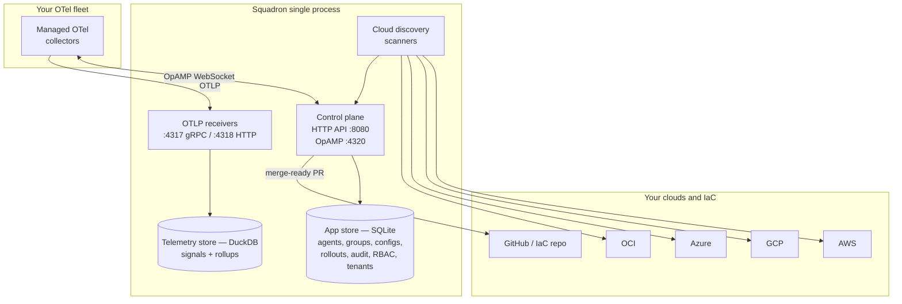

# Architecture

Squadron runs as a **single process** — one binary, one container — that
composes a control plane, two stores, a set of OTLP receivers, and the
outbound connectors it uses to discover cloud resources and open pull
requests. This page walks through each component and how they fit together.

## The picture

!!! note "See also"
    The repository ships a hand-drawn current-and-future view at
    [`docs/diagrams/architecture-current-and-future.svg`](../diagrams/architecture-current-and-future.svg)
    that pairs well with the component notes below.

## Components

### Control plane (HTTP API :8080, OpAMP :4320)

The heart of Squadron. Two servers share the process:

- **REST + UI on `:8080`** — a Gin-based JSON API under `/api/v1/*`, the
  embedded React UI, and a Prometheus `/metrics` surface. Every operator
  action — creating a rollout, editing a config, provisioning a tenant — is an
  HTTP call here.
- **OpAMP server on `:4320`** — manages collectors over a WebSocket
  connection: it distributes configurations, tracks agent status and
  capabilities, and observes drift. This is the control channel that makes an
  agent *managed* rather than telemetry-only.

### App store (SQLite)

Squadron's durable application state lives in an embedded SQLite database:
agents, groups, configs, rollouts, the append-only audit log, and — in the
enterprise edition — the RBAC roles/bindings and per-tenant rows. Configs are
immutable and versioned by hash; that hash is what a collector reports back so
Squadron can compute drift.

### Telemetry store (DuckDB)

Incoming telemetry and its rollups are stored separately in DuckDB, which is
built for the analytical queries that power Cost Insights and the Savings
projection. Keeping telemetry out of the application store means a firehose of
signal never contends with control-plane writes.

### OTLP receivers (:4317 gRPC, :4318 HTTP)

Collectors send traces, metrics, and logs over OTLP. A bounded worker pool
parses, enriches, and persists each batch into the telemetry store. The worker
pool also drives **passive OTLP discovery**: when it sees a
`service.instance.id` with no matching agent record, it registers a
telemetry-only agent automatically.

### Managed OTel collectors

The collectors themselves run in your environment. Each opens an OpAMP
connection to `:4320` (making it managed) and ships OTLP to the receivers.
Squadron pushes configs down the OpAMP channel and watches the reported config
hash for drift.

### Cloud discovery scanners (AWS / GCP / Azure / OCI)

Squadron periodically scans connected cloud accounts to inventory what's
running — compute, databases, Kubernetes, serverless, object stores, load
balancers, event sources — and flags the resources with missing or broken
OpenTelemetry instrumentation. The scanners feed the recommendations engine,
which drafts the fix.

### IaC / GitHub

When a gap has a fix, Squadron opens a **merge-ready Terraform pull request**
against your IaC repository: HCL-aware, merged into your existing config, and
gated on `terraform validate`. It also processes inbound GitHub webhooks to
track the lifecycle of the PRs it opened.

## Why single-process

A single binary keeps the operational surface small: one thing to deploy, one
thing to back up, one thing to upgrade. The stores are embedded, the receivers
and servers boot together, and the whole loop — discover, codify, roll out,
audit — runs inside one process. The enterprise edition adds capabilities
against the same seams (see [Enterprise overview](../enterprise/overview.md))
without changing this shape.
