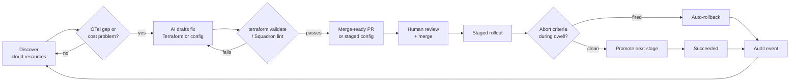
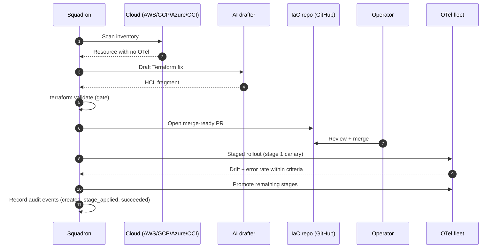

# How the loop works

Squadron's whole product is one loop run continuously: **discover** what's
running, **codify** the fix for anything under-instrumented or over-spending,
**roll it out** safely, and **audit** every step. Each hop is designed to be
reviewable — nothing reaches production without a `terraform validate` gate, a
human merge, and a staged rollout with auto-abort.

## The loop at a glance

## Stage by stage

### 1. Discover

Two discovery surfaces run in parallel. **Cloud discovery** scanners inventory
AWS, GCP, Azure, and OCI — compute, databases, serverless, and more — and flag
resources with missing or broken OpenTelemetry. **Fleet discovery** tracks the
collectors themselves: managed agents arrive over OpAMP, and telemetry-only
agents are registered passively when their OTLP shows up without a control
channel. See [Discovery](../discovery.md).

### 2. Detect the gap

For an un-instrumented cloud resource, the gap is "no OTel here." For an
existing pipeline, the gap can be a **cost problem** — the cost-spike detector
compares the current $/month projection against a rolling baseline every minute
and opens an attributed event when spend jumps. Either way, Squadron now has a
concrete thing to fix.

### 3. Codify — AI drafts the fix

With `ANTHROPIC_API_KEY` set, Squadron drafts the remediation: a Terraform
fragment for an instrumentation gap, or a collector-config change for a cost
regression. The deterministic Terraform snippets are correctness-audited; the
free-form reasoning is explained in plain English so you can review it before
merging.

### 4. Gate — validate before it reaches you

Terraform fixes are **HCL-aware merged** into your existing config and gated on
`terraform validate`; config changes run through Squadron's lint engine, diff
preview, and rollout preview. A fix that doesn't validate loops back for a
redraft rather than landing in your inbox broken.

### 5. Merge — human in the loop

A validated Terraform fix becomes a **merge-ready pull request** against your
IaC repo. You review the diff and merge (or decline — a decline teaches future
scans). Squadron never merges for you; every change is a PR gated by your review
plus CI.

### 6. Roll out — staged, with auto-abort

Config changes ship through a [staged rollout](../rollouts.md): percent- or
label-based stages, a per-stage dwell, and abort criteria on drift and error
rate. During each dwell the engine ticks every few seconds; if a criterion
fires, the rollout flips to `aborted` and Squadron pushes the previous config
back automatically.

### 7. Audit — record everything

Every state change — config stored, PR opened, stage applied, rollout aborted,
approval granted — lands in the [append-only audit log](../audit-log.md). That
record is what closes the loop: it's the durable evidence of what happened, and
it feeds the next scan.

## One gap, end to end

Here is a single instrumentation gap being closed, as a sequence:

If the canary had drifted past the abort threshold, step 8 would instead be an
auto-abort and rollback — and the audit log would carry `rollout.aborted`
followed by `rollout.rolled_back` with the reason. Either way the loop returns
to discovery, now aware of the change it just made.
