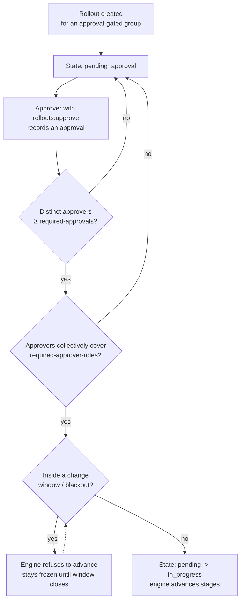

# Approvals and change windows

The Compliance Pack turns Squadron's rollout `require_approval` metadata from a
hint into an enforced control — the actual SOC 2 / NERC CIP separation-of-duties
requirement. In the OSS core a group can *carry* `require_approval`, but the
engine doesn't block on it; the Compliance Pack's `GroupPolicyProvider` is what
makes it actually hold a rollout in `pending_approval` and refuse to advance
until the approval bar is met.

!!! note "Where these fit in the rollout lifecycle"
    An approval-gated rollout enters `pending_approval` on creation and only
    returns to `pending` (and then `in_progress`) once the gate clears. See the
    [rollout state machine](../rollouts.md#the-rollout-state-machine).

## Separation of duties

Approving a rollout is a **distinct capability** from creating one. The
`rollouts:approve` scope gates the approve action, separate from
`rollouts:write` — so the identity that ships a change is not automatically the
identity that can bless it. Under [RBAC](rbac.md) you grant `rollouts:approve`
to a different role (say `release-approver`) than the one your CI deployer
carries.

## N-of-M distinct approvers

The gate requires **N distinct approvers out of the eligible M** — the same
principal cannot satisfy two of the required approvals. The per-group minimum is
set with a group label:

```
squadron.io/required-approvals=2
```

With `required-approvals=2`, a rollout against that group stays in
`pending_approval` until two *different* approvers (each holding
`rollouts:approve`) have signed off.

## Rule-based required approver roles

Beyond a raw count, a group can mandate that the approvals **cover specific
roles** — so a security-sensitive change needs sign-off from both security and
SRE, not just any two approvers:

```
squadron.io/required-approver-roles=security,sre
```

The gate is then satisfied only when the distinct approvers **collectively hold
every required role**. Two SREs approving does not clear a rule that also
requires `security`.

## The N-of-M gate



Both conditions must hold: the distinct-approver **count** meets the minimum
**and** the approvers' **roles** cover every required role. Until then the
rollout stays pending.

## Change windows (blackout freeze)

Change windows are a hard freeze on when rollouts may advance. The Compliance
Pack's `changewindow.Provider` reads a group's configured windows and returns
the active one, so the **rollout engine refuses to advance during a freeze** —
a stage that would otherwise promote simply waits until the blackout closes. The
window time-math (IANA timezone, day-of-week, midnight wrap) lives in the open
core's `extension/changewindow`; the Compliance Pack fetches and dispatches.

This composes with approvals: a rollout can be fully approved and *still* held
because it's inside a blackout window. Both gates are independent, and both must
be clear before the engine promotes the next stage.

!!! tip "Rollbacks can be gated too"
    A group can require approval on rollbacks independently of forward rollouts
    via `require_approval_for_rollback`, letting a compliance-strict operator
    treat undo as a more sensitive action than the original change. See
    [Rollouts → per-group rollback approval policy](../rollouts.md).
