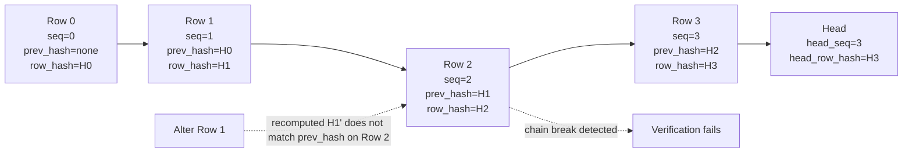

# Compliance audit and attestation

The Compliance Pack turns Squadron's [audit log](../audit-log.md) into
**tamper-evident, exportable evidence**. Every recorded event is chained by a
per-tenant hash, the chain can be self- and fleet-verified, a sealed attestation
gives you SOC 2 evidence, an offline CLI lets an auditor re-verify with **zero
secrets**, and every authenticated mutating request lands as a per-call
`api.request` row.

## Tamper-evident hash-chain

Each audit row carries three chain columns, sequenced **per tenant**:

- **`seq`** — a monotonically increasing sequence number within the tenant.
- **`prev_hash`** — the `row_hash` of the previous row in that tenant's chain.
- **`row_hash`** — a hash over this row's content **and** its `prev_hash`.

Because each row's hash folds in the previous row's hash, the chain is a
Merkle-style linked list: any change to a historical row breaks every `row_hash`
from that point forward, and the break is detectable without any secret.



## Verify and attest

- **Self-verify** — Squadron recomputes a tenant's chain from row 0 and confirms
  the recomputed head matches the stored head (`head_seq` / `head_row_hash`).
- **Fleet verify** — the same recomputation across **all tenants**, so an
  operator can attest the entire instance in one pass.
- **Sealed attestation** — Squadron emits an attestation JSON pinning the head
  (`head_seq`, `head_row_hash`) and, when `SQUADRON_SECRETS_KEY` is set, a
  `sealed_sig` in which the Squadron key vouches for that head. That signed
  head is the SOC 2 evidence artifact.

## Offline verifier CLI

`squadron-audit-verify` is a standalone, dependency-light CLI an auditor runs
with **zero secrets** to independently re-verify an attestation:

```bash
make build-audit-verify   # -> bin/squadron-audit-verify

bin/squadron-audit-verify \
  -export audit-chain.csv \
  -attestation attestation.json \
  [-tenant <id>]
```

Feed it the chain-column audit export
(`GET /api/v1/audit/events?include_chain=1`, CSV or JSON) and the attestation
JSON. It recomputes the hash-chain offline and confirms the recomputed head
matches the attestation's `head_row_hash` / `head_seq`, exiting **non-zero** if
the chain is invalid or the tip does not match. If `SQUADRON_SECRETS_KEY` is set
and the attestation carries a `sealed_sig`, it additionally opens the seal to
confirm the Squadron key vouches for that head — but a missing or rotated key
**never** fails the primary zero-secret result.

## Cross-tenant export and review

The single-tenant CSV/JSON evidence export ships in OSS breadth.
The enterprise wedge is the cross-tenant surface:

- **Audit export** (`/api/v1/audit-export/*`) — a streamed CSV/NDJSON export
  across tenants.
- **Access review** (`/api/v1/audit-review/*`) — cross-tenant access-review
  queries with per-actor, per-resource, and per-tenant patterns.

!!! note "These need the cross-tenant scopes"
    Reaching beyond a single tenant requires the dedicated cross-tenant scopes
    (`audit:export`, `audit:cross_tenant`) in addition to the base read — see the
    [cross-tenant two-scope rule](multi-tenancy.md#the-cross-tenant-two-scope-rule).

## SIEM export

The Compliance Pack builds a **bounded-queue dispatcher** and installs a fan-out
adapter on the audit service, so **every recorded audit event is forwarded to
every configured destination**. Two poster types ship:

- **Splunk HEC** — HTTP Event Collector.
- **HMAC-signed webhook** — a generic signed webhook post.

The engine and exporter code live in the open core's `internal/siem` but are
left un-constructed there; the Compliance Pack's wire file constructs the
dispatcher, starts it, and hooks it to the audit service. In OSS the SIEM
destinations can be stored but are never delivered to.

## Per-call access audit

The Compliance Pack also installs `middleware.APIAccessAudit`, so **every
authenticated mutating request** lands in `audit_events` as an `api.request`
row — per-call evidence of who did what, alongside the existing state-change
events and the RBAC `authz.decision` events. Together they give an access review
the full transcript: the request, the authorization decision, and the resulting
state change.
