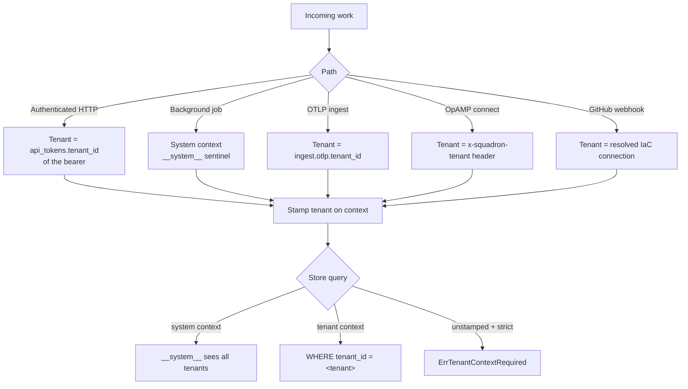

# Multi-tenancy

The enterprise edition gives Squadron **real per-tenant isolation** of the
SQLite application store — across the authenticated HTTP path, background jobs,
and every ingress path. A request's tenant is derived from
`api_tokens.tenant_id`; the SQLite store methods read that tenant off the
context and add a `tenant_id` predicate to every query. In OSS the same
predicate is inert (one implicit `default` tenant returns everything); real
isolation is the enterprise wedge.

## How scoping resolves



## Provisioning tenants

Tenant management lives under `/api/v1/tenants/*` (enterprise-only; OSS returns
404). Routes are gated `tenants:read` / `tenants:write`; the bootstrap admin
token passes.

!!! note "Trailing slash matters"
    The base collection route is `/tenants/` **with** the slash. A bare
    `POST /api/v1/tenants` 307-redirects to `/api/v1/tenants/` before the
    wildcard is consulted — POST to `/tenants/` directly.

A tenant's id is the **slugified name**:

```bash
curl -sX POST localhost:8080/api/v1/tenants/ \
  -H "Authorization: Bearer $TOKEN" -H 'Content-Type: application/json' \
  -d '{"name":"Acme"}'
# -> 201 {"tenant_id":"acme","name":"Acme","created_at":"..."}

curl -s localhost:8080/api/v1/tenants/ -H "Authorization: Bearer $TOKEN"
# -> {"tenants":[{"tenant_id":"default",...},{"tenant_id":"acme",...}]}
```

Assign a token to a tenant (sets `api_tokens.tenant_id`; every subsequent scoped
query then isolates that token to `acme`):

```bash
curl -sX POST localhost:8080/api/v1/tenants/acme/tokens \
  -H "Authorization: Bearer $TOKEN" -H 'Content-Type: application/json' \
  -d '{"token_id":"<api-token-id>"}'
# -> 200 {"tenant_id":"acme","token_id":"<id>","assigned":true}
```

!!! warning "Guard rails on delete"
    Delete-guards return **400**: you cannot delete the `default` tenant, and
    you cannot delete a tenant that still owns tokens. Reassign or revoke its
    tokens first.

## Two special tenants

- **`default`** — a real, filterable tenant. In OSS it is the single implicit
  tenant; in enterprise it's where unspecified ingress lands unless bound
  elsewhere. It cannot be deleted.
- **`__system__`** — the SystemTenant sentinel used for fleet-wide background
  jobs. It is **distinct** from `default` on purpose: a missed tenant stamp
  degrades to `default` (visibly-empty results in dev), never a silent
  cross-tenant corruption. A system context sees all tenants; that is the only
  cross-tenant read path.

## Strict scoping and ingress tenanting

Strict scoping is **auto-on in the enterprise wire** (no config knob). It flips
three things:

- `sqlite.SetStrictTenantScoping(true)` — any store call on an unstamped,
  non-system context returns `ErrTenantContextRequired` instead of silently
  landing in `default`.
- `opamp.SetRejectUntenantedConnections(true)` — a header-less OpAMP connection
  is rejected at connect (401).
- the OTLP fatal-check — an unset `ingest.otlp.tenant_id` while the receiver is
  enabled is a **startup fatal**.

Each ingress path writes rows outside the authenticated HTTP path, so it
declares its tenant by configuration or protocol:

| Ingress | Tenant source | Under strict, unspecified |
|---|---|---|
| **OTLP** | `ingest.otlp.tenant_id` (single tenant per instance) | startup fatal |
| **OpAMP** | `x-squadron-tenant` header, per connection | rejected at connect (401) |
| **GitHub webhook** | resolved IaC connection's `tenant_id` | unmatched repo → processed under the **system context** (HMAC-authenticated; the dedupe/audit row is worth keeping) |

## The cross-tenant two-scope rule

Cross-tenant operations (fleet-wide export, all-tenant review, SSO across
tenants) are gated by **dedicated cross-tenant scopes** — `audit:cross_tenant`,
`sso:cross_tenant`, `usage:cross_tenant` — that a normal tenant-scoped token
does **not** carry. In effect a cross-tenant action needs *two* things: the
base scope for the operation **and** the `*:cross_tenant` scope authorizing it
to reach beyond its own tenant. A token bound to `acme` cannot read `default`'s
rows just by holding `audit:export`; it also needs `audit:cross_tenant`.

## Tenant-isolation verification checklist

- [ ] Startup log shows `enterprise: strict tenant scoping ENABLED`.
- [ ] Clean boot under strict: the bootstrap token issues with **zero**
      `ErrTenantContextRequired` in the logs (startup/background paths are
      system-stamped).
- [ ] Assign token A to tenant A and token B to tenant B.
- [ ] Token A creates a resource (e.g. a group); **token A sees it**.
- [ ] **Token B's list is empty** — no leakage across the tenant boundary.
- [ ] A cross-tenant `GET`-by-id returns **404**; a cross-tenant `DELETE`
      matches **0 rows**.
- [ ] An OpAMP connection with no `x-squadron-tenant` header is **rejected
      (401)**.
