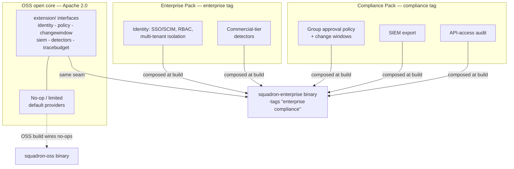

# Enterprise + Compliance overview

The Squadron **Enterprise + Compliance** edition adds the depth, scale,
governance, and support that organizations need on top of the free open core.
The SMB / single-team experience stays free forever under Apache 2.0; the
commercial edition never takes away what's already open.

## The open-core model

The OSS / enterprise line is a **build-time boundary, not a runtime license
check** — and never a fork. The open core defines extension-point interfaces
(under `extension/`) and compiles **no-op providers**; the enterprise and
compliance packs supply the real providers, dropped into the build tree and
picked up under an edition build tag. The entitlement is *which code is compiled
in* — an OSS binary cannot be turned into an enterprise binary by flipping a
config flag.

The `enterprise` tag is an **umbrella**: it composes the identity/RBAC/tenancy
pack plus the commercial detectors, and the enterprise build sets the
`compliance` tag alongside it (`-tags "enterprise compliance"`) so the
Compliance Pack's group-approval policy, change windows, SIEM export, and
access-audit middleware come along. See [build.md](../build.md) for the full
seam contract.

!!! note "Prove the edition at runtime"
    Confirm which edition is running via the startup log
    (`squadron build edition {edition=squadron-enterprise}`) or the
    `squadron_build_info{edition="squadron-enterprise"} 1` gauge on `/metrics`.
    OSS reports `edition="squadron-oss"`. See [Deployment](deployment.md).

## What the edition adds

| Capability | What it adds | Details |
|---|---|---|
| **RBAC** | Deny-by-default, store-backed roles and bindings that replace flat token scopes at the enforcement seam; every decision is an `authz.decision` audit event. | [rbac.md](rbac.md) |
| **Multi-tenancy** | Real per-tenant isolation of the application store across the HTTP path, background jobs, and ingress, with a `__system__` sentinel for fleet-wide work. | [multi-tenancy.md](multi-tenancy.md) |
| **SSO / SCIM** | OIDC single sign-on (login mints a Squadron bearer) plus SCIM 2.0 directory provisioning with group→role mapping and strict identity-source mode. | [sso-scim.md](sso-scim.md) |
| **Approvals + change windows** | `rollouts:approve` separation of duties, N-of-M distinct approvers, per-group required-approver counts and roles, and blackout change windows the engine refuses to advance through. | [approvals.md](approvals.md) |
| **Tamper-evident audit + attestation** | Per-tenant hash-chained audit rows, self- and fleet-verify, sealed SOC 2 attestation, an offline zero-secret verifier CLI, and per-call `api.request` evidence. | [compliance-audit.md](compliance-audit.md) |
| **SIEM export** | A bounded-queue dispatcher that fans every recorded audit event out to Splunk HEC and HMAC-signed webhook destinations. | [compliance-audit.md](compliance-audit.md#siem-export) |

## Where it fits

Everything above lands behind a **capability seam** that is inert in the OSS
build — the OSS test suite proves the inertness — and only becomes load-bearing
when the enterprise wire files are compiled in. The result: the same codebase,
the same architecture (see [Architecture](../concepts/architecture.md)), with
governance and scale added on top rather than bolted on.

Start with [Deployment](deployment.md) to build and boot the enterprise binary.
