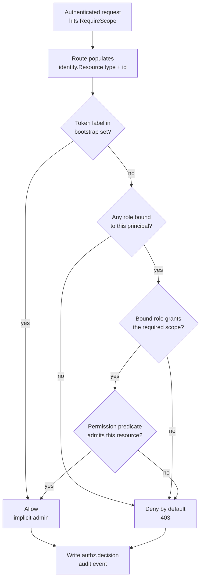

# RBAC

The enterprise edition replaces the OSS flat-scope authorizer with a
**store-backed, deny-by-default, resource-aware** role engine at the single
`middleware.RequireScope` enforcement seam. Roles and bindings are a real,
API-managed product surface — not a redeploy-to-change static file — and every
allow/deny is written to the audit log as an `authz.decision` event.

!!! note "RBAC only bites with auth on"
    RBAC applies only when `auth.enabled=true`. With auth off the bearer
    middleware is unmounted, `RequireScope` short-circuits, and the authorizer
    is never consulted. See [Deployment](deployment.md#2-boot).

## The decision path



## The scope model

A **role** is a tenant-scoped bundle of permissions. Each permission is
`{scope, resource_type, all_resources, resource_ids}`:

- **scope** — the same scope vocabulary the OSS bearer layer uses
  (`rollouts:read`, `configs:write`, and so on).
- **resource_type** — the kind of resource this permission governs
  (`rollout`, `config`, ...).
- **all_resources** — when `true`, the permission covers every resource of that
  type; when `false`, it is restricted to the listed IDs.
- **resource_ids** — the explicit allow-list used when `all_resources` is
  `false`.

A **binding** attaches a role to a principal. There is no user model, so a
binding keys on the API token: `{role_id, principal_kind, principal_ref}` where
`principal_kind ∈ {token_id, token_label}`. Binding by `token_label` covers
every token carrying that label.

## Creating roles and bindings

Role and binding management lives under `/api/v1/rbac/*` (enterprise-only; OSS
returns 404). The routes are gated `rbac:read` / `rbac:write`; the bootstrap
admin token passes.

Create a role — read on all rollouts, write on two specific ones:

```bash
curl -sX POST localhost:8080/api/v1/rbac/roles \
  -H "Authorization: Bearer $TOKEN" -H 'Content-Type: application/json' \
  -d '{
        "name": "rollout-operator",
        "permissions": [
          {"scope":"rollouts:read","resource_type":"rollout","all_resources":true,"resource_ids":[]},
          {"scope":"rollouts:write","resource_type":"rollout","all_resources":false,"resource_ids":["ro-1","ro-2"]}
        ]
      }'
# -> 201 {"id":"...","name":"rollout-operator","permissions":[...]}
```

Bind it to a principal by token label:

```bash
curl -sX POST localhost:8080/api/v1/rbac/bindings \
  -H "Authorization: Bearer $TOKEN" -H 'Content-Type: application/json' \
  -d '{"role_id":"<role-id>","principal_kind":"token_label","principal_ref":"ci-deployer"}'
# -> 201 {"id":"...","role_id":"<role-id>","principal_kind":"token_label","principal_ref":"ci-deployer"}
```

List and delete follow the obvious shapes:

```bash
curl -s         localhost:8080/api/v1/rbac/roles          -H "Authorization: Bearer $TOKEN"   # {"roles":[...]}
curl -sX DELETE localhost:8080/api/v1/rbac/roles/<role-id> -H "Authorization: Bearer $TOKEN"
curl -s         localhost:8080/api/v1/rbac/bindings              -H "Authorization: Bearer $TOKEN"   # {"bindings":[...]}
curl -sX DELETE localhost:8080/api/v1/rbac/bindings/<binding-id>  -H "Authorization: Bearer $TOKEN"
```

## Break-glass so you never lock yourself out

A zero-role tenant resolves the deployment's **bootstrap token(s)** to implicit
admin, so enabling RBAC can never lock the operator out. The bootstrap label set
defaults to `bootstrap` and is extended additively:

```bash
export SQUADRON_RBAC_BOOTSTRAP_LABELS="bootstrap,break-glass"
```

Any token whose label is in that set passes `rbac:*` / `tenants:*` before any
role exists — letting you provision the first real roles and tenants. Revoke the
bootstrap token once real scoped tokens and roles are in place; keep a
break-glass label as the strict-identity lockout safety net.

## Deny-by-default: flat scopes stop being an authority

!!! warning "Once real roles exist, flat token scopes are NOT consulted"
    Enterprise flips the OSS default (`empty scopes = legacy full access`) to
    **deny**. Once any real role exists, a token whose *flat* scopes would have
    granted access is still **denied** unless a **bound role** grants the
    required scope — and, where the route carries a resolvable resource, the
    permission's predicate admits that resource. The enterprise authorizer does
    not consult flat token scopes.

Every decision — allow or deny — is emitted as an `authz.decision` audit event,
so an access review can reconstruct exactly what was permitted and why. See
[Compliance audit](compliance-audit.md).

!!! note "Known gap"
    The `rollouts.go` in-handler scope gate currently bypasses the authorizer
    seam and keeps OSS-legacy scope semantics (filed, not yet closed).
