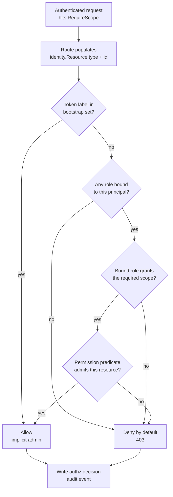

# RBAC

The enterprise edition replaces the OSS flat-scope authorizer with a
**store-backed, deny-by-default, resource-aware** role engine at the single
`middleware.RequireScope` enforcement seam. Roles and bindings are a real,
API-managed product surface, not a redeploy-to-change static file, and every
allow/deny is written to the audit log as an `authz.decision` event.

!!! note "RBAC only bites with auth on"
    RBAC applies only when `auth.enabled=true`. With auth off the bearer
    middleware is unmounted, `RequireScope` short-circuits, and the authorizer
    is never consulted. See [Deployment](deployment.md#2-boot).

## The decision path


```mermaid
flowchart TD
    REQ[Authenticated request<br/>hits RequireScope] --> RES[Route populates<br/>identity.Resource type + id]
    RES --> BG{Token label in<br/>bootstrap set?}
    BG -- yes --> ALLOW[Allow<br/>implicit admin]
    BG -- no --> ROLES{Any role bound<br/>to this principal?}
    ROLES -- no --> DENY[Deny by default<br/>403]
    ROLES -- yes --> PERM{Bound role grants<br/>the required scope?}
    PERM -- no --> DENY
    PERM -- yes --> PRED{Permission predicate<br/>admits this resource?}
    PRED -- no --> DENY
    PRED -- yes --> ALLOW
    ALLOW --> AUD[Write authz.decision<br/>audit event]
    DENY --> AUD
```

## The scope model

A **role** is a tenant-scoped bundle of permissions. Each permission is
`{scope, resource_type, all_resources, resource_ids}`:

- **scope**, the same scope vocabulary the OSS bearer layer uses
  (`rollouts:read`, `configs:write`, and so on).
- **resource_type**, the kind of resource this permission governs
  (`rollout`, `config`...).
- **all_resources**, when `true`, the permission covers every resource of that
  type; when `false`, it is restricted to the listed IDs.
- **resource_ids**, the explicit allow-list used when `all_resources` is
  `false`.
- **label_match** *(optional; ADR 0053)*, a `{key: value}` map that further
  narrows the permission to resources carrying matching **cluster/environment**
  labels. All entries must match (AND) against the resource's server-observed
  `deployment.environment` / `k8s.cluster.name`; an unknown key or an empty label
  on the resource **fails closed**. Omit it (the default) for a
  label-agnostic permission. This is how you build a *prod-only* or
  *us-west-2-only* role, see [Cluster/environment-scoped roles](#clusterenvironment-scoped-roles).

A **binding** attaches a role to a principal. There is no user model, so a
binding keys on the API token: `{role_id, principal_kind, principal_ref}` where
`principal_kind ∈ {token_id, token_label}`. Binding by `token_label` covers
every token carrying that label.

## Creating roles and bindings

Role and binding management lives under `/api/v1/rbac/*` (enterprise-only; OSS
returns 404). The routes are gated `rbac:read` / `rbac:write`; the bootstrap
admin token passes.

Create a role, read on all rollouts, write on two specific ones:

```bash
curl -sX POST localhost:8080/api/v1/rbac/roles \
  -H "Authorization: Bearer $TOKEN" -H 'Content-Type: application/json' \
  -d '{
        "name": "rollout-operator",
        "permissions": [
          {"scope":"rollouts:read","resource_type":"rollout","all_resources":true,"resource_ids":[]},
          {"scope":"rollouts:write","resource_type":"rollout","all_resources":false,"resource_ids":["ro-1","ro-2"]}
        ]
      }'
# -> 201 {"id":"...","name":"rollout-operator","permissions":[...]}
```

For a full-admin role, use the wildcard scope with an any-type permission. The
resource type is "any" when it is `"*"` or omitted entirely; the scope wildcard
is `"*"`:

```bash
curl -sX POST localhost:8080/api/v1/rbac/roles \
  -H "Authorization: Bearer $TOKEN" -H 'Content-Type: application/json' \
  -d '{"name":"platform-admin",
        "permissions":[{"scope":"*","resource_type":"*","all_resources":true}]}'
```

Note the wildcards are exact: `"*"` matches any scope and (for `resource_type`)
any type. Prefix globs such as `agents:*` are not expanded, so enumerate the
concrete scopes a narrower role needs rather than relying on a partial glob.

Bind it to a principal by token label:

```bash
curl -sX POST localhost:8080/api/v1/rbac/bindings \
  -H "Authorization: Bearer $TOKEN" -H 'Content-Type: application/json' \
  -d '{"role_id":"<role-id>","principal_kind":"token_label","principal_ref":"ci-deployer"}'
# -> 201 {"id":"...","role_id":"<role-id>","principal_kind":"token_label","principal_ref":"ci-deployer"}
```

List and delete follow the obvious shapes:

```bash
curl -s         localhost:8080/api/v1/rbac/roles          -H "Authorization: Bearer $TOKEN"   # {"roles":[...]}
curl -sX DELETE localhost:8080/api/v1/rbac/roles/<role-id> -H "Authorization: Bearer $TOKEN"
curl -s         localhost:8080/api/v1/rbac/bindings              -H "Authorization: Bearer $TOKEN"   # {"bindings":[...]}
curl -sX DELETE localhost:8080/api/v1/rbac/bindings/<binding-id>  -H "Authorization: Bearer $TOKEN"
```

## Cluster/environment-scoped roles

*(ADR 0053. Released in enterprise `v0.89.486`.)*

Add a `label_match` to a permission to scope it to a cluster or environment. The
authorizer stamps the target's server-observed `deployment.environment` /
`k8s.cluster.name` onto the `identity.Resource` and admits the permission only
when every `label_match` entry matches. This works for agent and rollout actions
and for the scoped audit views (`resource_type: "audit"`).

Create a **prod-only** auditor, read audit events in `prod`, nothing else:

```bash
curl -sX POST localhost:8080/api/v1/rbac/roles \
  -H "Authorization: Bearer $TOKEN" -H 'Content-Type: application/json' \
  -d '{
        "name": "prod-auditor",
        "permissions": [
          {"scope":"audit:read","resource_type":"audit","all_resources":true,
           "label_match":{"deployment.environment":"prod"}}
        ]
      }'
```

A holder of this role must query the scope it is granted and **fails closed**
everywhere else:

```text
GET /api/v1/audit-review/?env=prod      -> 200  (only prod events)
GET /api/v1/audit-review/?env=staging   -> 403  (no role grants this scope)
GET /api/v1/audit-review/               -> 403  (unscoped request fails closed)
```

The same shape scopes agent/rollout mutation roles, e.g. an `agents:write`
permission with `label_match:{"deployment.environment":"prod"}` lets a
prod on-call PATCH prod agents (200) but not staging ones (403).

!!! warning "This is a least-privilege filter within the tenant"
    On its own, `label_match` scopes what an *operator* may touch. Because
    `deployment.environment` / `k8s.cluster.name` are client-asserted
    `AgentDescription` labels, it is **not** an agent-spoofing boundary unless
    you also bind those labels to the enrollment credential, see
    [Authenticated env/cluster binding](#authenticated-envcluster-binding).

## Authenticated env/cluster binding

*(ADR 0056. Released: OSS seam `v0.89.485` + enterprise fill `v0.89.486`.)*

By default an agent's `deployment.environment` / `k8s.cluster.name` come from the
`AgentDescription` it reports, a display hint the agent controls. To make
cluster/env scoping a real boundary, **pin** the authorized values onto the
agent's OpAMP enrollment token. The pin rides the token **label** as
whitespace-separated `env:` / `cluster:` segments (composable with the
identity pin `pin:<fleetid>` from ADR 0052):

```bash
# Mint a prod-pinned enrollment token (requires the agents:write scope).
curl -sX POST localhost:8080/api/v1/auth/tokens \
  -H "Authorization: Bearer $TOKEN" -H 'Content-Type: application/json' \
  -d '{"label":"env:prod cluster:us-west-2","scopes":["opamp:enroll"]}'
```

When an agent connects with that token, the pinned values are **authoritative**:
they overwrite whatever the agent reports, and a disagreeing reported label is
logged + counted (`opamp_label_pin_mismatch_total`) but the agent is never
dropped (**relabel-and-log**). So a staging box presenting `env=prod` is
relabeled to its token-authorized env and can never reach prod-scoped config or
audit.

- **Minting is gated.** The `env:` / `cluster:` (and `pin:`) label prefixes
  require the `agents:write` scope; an ordinary `auth:write` token-minter cannot
  issue a scope-pinned enrollment token.
- **Leading run only.** Pins are honored from the leading contiguous run of
  pin segments, matching the mint guard's leading-prefix check, a pin segment
  after a plain name segment (e.g. `ci-runner env:prod`) is neither gated nor
  honored, so it cannot smuggle in an ungated scope.
- **Grace-first.** Unpinned enrollment tokens are unaffected; adopt the boundary
  by minting pinned tokens.

## Break-glass so you never lock yourself out

A zero-role tenant resolves the deployment's **bootstrap token(s)** to implicit
admin, so enabling RBAC can never lock the operator out. The bootstrap label set
defaults to `bootstrap` and is extended additively:

```bash
export SQUADRON_RBAC_BOOTSTRAP_LABELS="bootstrap,break-glass"
```

Any token whose label is in that set passes `rbac:*` / `tenants:*` before any
role exists, letting you provision the first real roles and tenants. Revoke the
bootstrap token once real scoped tokens and roles are in place; keep a
break-glass label as the strict-identity lockout safety net.

## Deny-by-default: flat scopes stop being an authority

!!! warning "Once real roles exist, flat token scopes are NOT consulted"
    Enterprise flips the OSS default (`empty scopes = legacy full access`) to
    **deny**. Once any real role exists, a token whose *flat* scopes would have
    granted access is still **denied** unless a **bound role** grants the
    required scope, and, where the route carries a resolvable resource, the
    permission's predicate admits that resource. The enterprise authorizer does
    not consult flat token scopes.

Every decision, allow or deny, is emitted as an `authz.decision` audit event,
so an access review can reconstruct exactly what was permitted and why. See
[Compliance audit](compliance-audit.md).

!!! note "Known gap"
    The `rollouts.go` in-handler scope gate currently bypasses the authorizer
    seam and keeps OSS-legacy scope semantics (filed, not yet closed).
