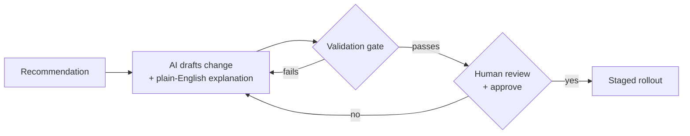

# How AI proposals work

*What this page answers: what the AI does when you turn it on, where the human stays in charge, and what information reaches the model.*

When Squadron has a recommendation, it can optionally draft the actual change
and explain it in plain English. The important word is **draft**: the AI
proposes, a human approves, and the change still flows through the same
validation and staged-rollout safeguards as any other change. **The AI never
applies anything directly.**

AI is **off by default.** You opt in, and when you do, you **bring your own or
self-host the model** — it's your provider and your key.

## The flow

Every AI action is something you initiated. There is no background analysis and
no autonomous change: the model is one step in a chain that already has
validation, human review, staged rollout, and automatic abort around it. If any
step in that chain finds a problem, the change does not ship.

## The privacy story

When AI is on and you trigger an action, Squadron sends the **context relevant
to that recommendation** — the configuration and surrounding detail the model
needs to draft or explain the change. That's it: no API tokens, no telemetry
data, no audit log, nothing outside the specific action's context.

- **It's your provider and your key.** Squadron calls the model endpoint you
  configure, with credentials you supply.
- **Self-hosting keeps everything in.** Point Squadron at a model you run
  yourself and no context leaves your environment.
- **You control what's in a config.** Because configuration context can be part
  of a payload, keep secrets out of your configs (use environment-variable
  references) so nothing sensitive is ever included.

!!! note "Model choice is yours"
    Which provider or model you use is a configuration you own. For enabling AI,
    provider setup, and the exact per-action payload, see
    [AI Assist](../ai-assist.md).

For what happens after you approve a drafted change, see
[How safe rollouts work](rollouts.md).
