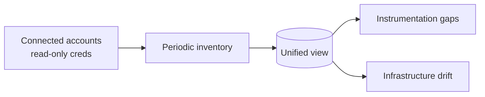

# How discovery works

*What this page answers: what Squadron looks at across your clouds, what it produces, and why it can never change anything while it looks.*

You connect a cloud account with **read-only** credentials. On a cadence,
Squadron takes inventory of what's running, notices which resources are missing
(or have lost) telemetry instrumentation, and notices where your live
infrastructure has drifted from your Terraform. The result is a single,
unified view of gaps and drift across every connected account.

Inputs and outputs, nothing in between:

- **Input** — the read-only view of your cloud accounts, plus your Terraform as
  the intended state.
- **Output** — an inventory with two things surfaced on top of it:
  *instrumentation gaps* (resources with missing or faulty telemetry) and
  *drift* (live infrastructure that no longer matches your code).

## Discovery only reads

Discovery **never modifies your cloud resources.** It lists and inspects; it
does not create, change, or restart anything. The credentials you connect are
read-only by design, so discovery physically cannot write.

Any fix that comes out of discovery is a separate, opt-in step: Squadron drafts
a change and opens it for your review. Looking and changing are two different
phases, and only you cross from one to the other.

## What you control

- **Which accounts and regions are connected.** Squadron only sees what you
  connect. See the per-cloud setup guides:
  [AWS](../discovery-aws-first-time-setup.md),
  [GCP](../discovery-gcp-first-time-setup.md),
  [Azure](../discovery-azure-first-time-setup.md),
  [OCI](../discovery-oci-first-time-setup.md), and
  [infrastructure-as-code](../discovery-iac-first-time-setup.md).
- **Cadence.** Inventory can run on demand, or on a schedule you set. Scheduled
  scanning is off until you turn it on, because scanning real accounts on a
  timer has cost and API-rate implications.
- **Whether to act.** A surfaced gap or drift is information. Nothing happens to
  it until you choose to draft and approve a fix.

## The flow

!!! note "Coverage varies by cloud and signal"
    What Squadron can detect depends on which cloud and which signal you're
    looking at — some detections need native metrics, and some need an add-on
    you enable. For the authoritative, per-cloud statement of what works where,
    see [Detection coverage & requirements](../detection-coverage.md).

For the full setup and day-to-day operation of discovery, see the
[Discovery operator guide](../discovery.md).
