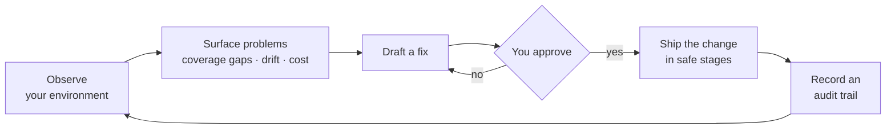

# How Squadron works

*What this page answers: the mental model — what Squadron does to your environment, and the guarantees you can rely on while it does it.*

Squadron runs one continuous loop: it observes your environment, surfaces
problems worth fixing, drafts a fix, waits for your approval, ships the change
safely, and records what happened. You stay in control at every hop.

## Core principles

Internalize these five and Squadron's behavior stops surprising you.

- **Read-only by default.** Observing your environment never changes anything.
  Discovery only looks; it does not touch your cloud resources.
- **Nothing ships without human approval.** Squadron drafts and proposes; a
  person reviews and approves. It never applies a change on its own.
- **Every change is staged and reversible.** Changes roll out in widening
  stages, each checked for health, and any change can be rolled back.
- **Self-hosted — your data stays in your environment.** You run Squadron in
  your own infrastructure. Nothing leaves the box unless you explicitly turn
  an outbound feature on.
- **Everything is audited.** Every meaningful action lands in a durable,
  append-only trail you can query after the fact.

!!! note "The method is a black box on purpose"
    Squadron takes an **input** (what's running, what it's costing, how it's
    behaving) and produces an **observable output** (a recommendation, a
    merge-ready change, a rollout decision). This documentation describes those
    inputs, outputs, and guarantees — not the internal method that connects
    them.

## What Squadron is — and isn't

Squadron is a **control plane** that sits in front of your telemetry backend
and your infrastructure-as-code. It watches for coverage gaps, configuration
drift, and cost, and it ships fixes through a safe, audited workflow.

It is **not**:

- your observability backend — it points at whatever backend you already run;
- a general-purpose CI/CD runner — it stages telemetry-configuration changes,
  it does not build or deploy your applications;
- an executor of cloud writes — it opens changes for review; your own review,
  CI, and branch protection remain the gate.

## Go deeper

- [How discovery works](discovery.md) — how Squadron takes read-only inventory.
- [How safe rollouts work](rollouts.md) — the staged, auto-reversing lifecycle.
- [Where your data lives](data-and-retention.md) — what's stored, what leaves.
- [How AI proposals work](ai-proposals.md) — opt-in drafting with a human gate.
- [Security & the audit trail](security-and-audit.md) — access control and
  independently verifiable evidence.

For step-by-step operational how-tos, see the operator guides:
[Discovery](../discovery.md), [Rollouts](../rollouts.md),
[Authentication](../auth.md), and [Operating Squadron](../operating.md).
