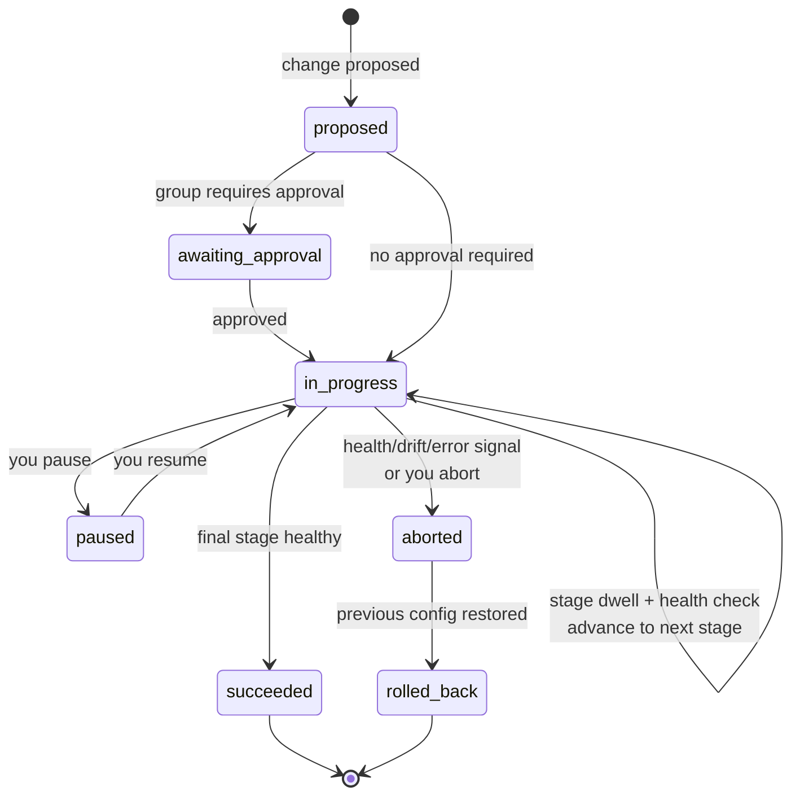

# How safe rollouts work

*What this page answers: what happens to a change once it's approved, and the guarantees that keep a bad change from reaching your whole fleet.*

A rollout is how Squadron ships a configuration change **without betting the
whole fleet on it at once.** Instead of applying everywhere immediately, it
widens the change stage by stage, checks health at each stage, and reverses
itself automatically if something looks wrong.

## The lifecycle you observe

1. A change is **proposed**.
2. If the target group requires it, the change **waits for approval**.
3. Once cleared, it rolls out in **stages** — a small slice first, then wider,
   selected by percentage or by label.
4. Each stage **dwells** (sits for a set time) and is **health-checked**.
5. A healthy stage **advances**; an unhealthy one **auto-aborts and rolls
   back** to the previous configuration.
6. **Completion is recorded** — success or reversal, either way.

## The guarantees

- **Nothing goes fleet-wide at once.** Every rollout starts on a slice and
  widens only after a healthy dwell.
- **A regression stops the rollout automatically.** If a stage looks unhealthy,
  the rollout aborts on its own and restores the previous configuration — no
  human needs to be watching.
- **You stay in control.** You can pause, resume, or abort a rollout at any
  time, and you can roll back a completed one after the fact.
- **Every transition is audited.** Creation, each stage, pauses, resumes,
  aborts, rollbacks, and completion all land in the audit trail.

## What can trigger an automatic abort

At a high level, a rollout watches for **health, drift, and error signals** on
the current stage's slice. If those signals cross the safety criteria you chose
for the rollout, it aborts and rolls back. You pick how strict those criteria
are per rollout (from cautious to permissive), so you decide the sensitivity —
Squadron applies it.

!!! note "The knobs, not the internals"
    The exact signals, thresholds, and timing are yours to set through the
    rollout's criteria and stage settings. For the full set of options —
    stages, dwell, abort criteria, recipes, templates, pause/resume, and
    completed-rollout rollback — see the [Rollouts operator guide](../rollouts.md).

For how a change becomes a proposal in the first place, see
[How AI proposals work](ai-proposals.md); for who is allowed to approve one,
see [Security & the audit trail](security-and-audit.md).
