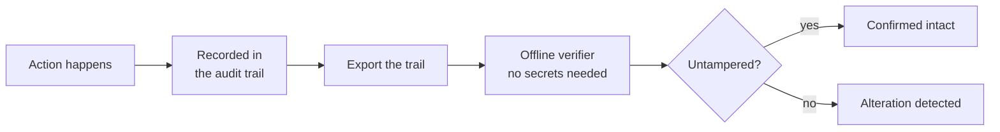

# Security & the audit trail

*What this page answers: how access to Squadron is controlled, and how you (or an auditor) can prove the audit trail wasn't altered.*

## Security posture

Squadron is **self-hosted**, so you own the network boundary — you decide what
is exposed and to whom. On top of that:

- **Authenticated API.** Access is gated by bearer tokens with scoped
  permissions, so a token can be limited to exactly the surfaces it needs. See
  [Authentication](../auth.md).
- **Enterprise access control.** The Enterprise edition adds role-based access
  control and multi-tenant isolation on top of the token layer — deny-by-default
  roles and real per-tenant separation. See the enterprise
  [RBAC](../enterprise/rbac.md) and [multi-tenancy](../enterprise/multi-tenancy.md)
  pages.
- **Secrets encrypted at rest.** Credentials you provide (cloud keys, tokens,
  webhook secrets) are stored sealed rather than in plaintext.
- **Orchestrator, not executor.** Squadron opens changes for review and stages
  rollouts; it never runs infrastructure applies on its own. Your review, CI,
  and branch protection stay the gate. See
  [Self-hosting security posture](../security-self-hosting.md).

## The audit trail

Every meaningful action Squadron takes is recorded in a durable, append-only
audit trail — who did what, when, and to what. It is the record you reach for
when something needs explaining after the fact. See [Audit log](../audit-log.md).

### It's tamper-evident

The value for an operator or auditor: you can **prove the log wasn't altered**.
The Enterprise edition makes the trail tamper-evident, and ships a bundled
verifier that lets you **check it independently, offline, and without trusting
Squadron** — you don't have to take the running system's word for the log's
integrity.

The verifier runs on your side, against an exported copy of the trail, and tells
you whether the record is intact — evidence you can hand to an auditor. For the
verification workflow and the SOC 2 attestation artifact, see the enterprise
[Compliance audit & attestation](../enterprise/compliance-audit.md) page.

## Related pages

- [Authentication](../auth.md) — tokens, scopes, and lifecycle.
- [Audit log](../audit-log.md) — what's recorded and how to query it.
- [Self-hosting security posture](../security-self-hosting.md) — the deployment
  checklist.
- Enterprise [RBAC](../enterprise/rbac.md),
  [multi-tenancy](../enterprise/multi-tenancy.md), and
  [compliance audit](../enterprise/compliance-audit.md).
