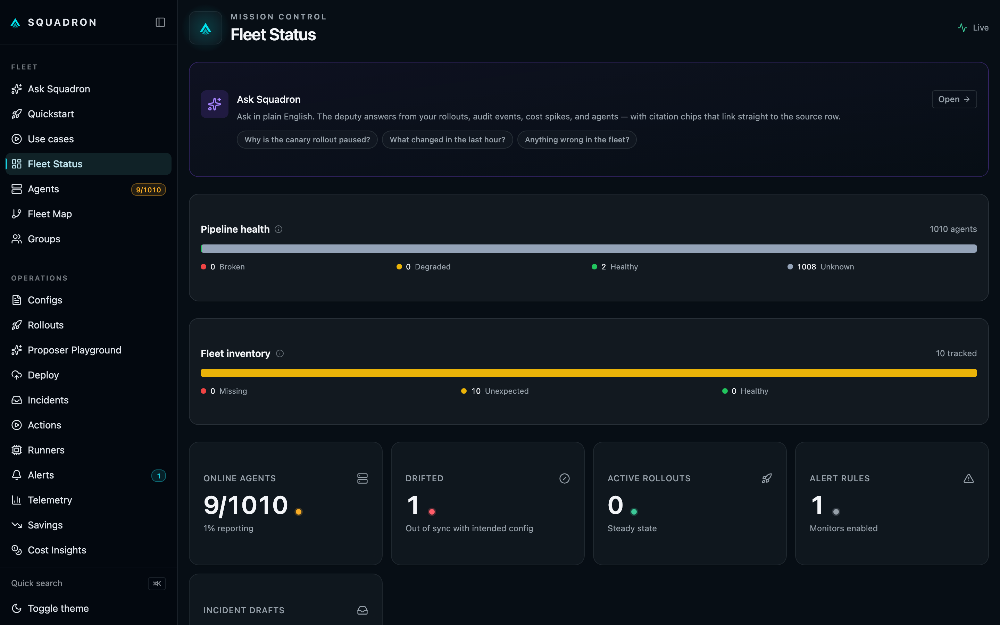
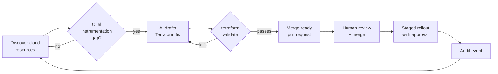

# Squadron

**The open-source OpenTelemetry control plane for coverage, cost, and safe rollouts.**

Squadron continuously discovers what's running across AWS, GCP, Azure, and OCI,
finds the resources with missing or broken OpenTelemetry instrumentation, and
opens a merge-ready Terraform pull request that fixes the gap — HCL-aware,
merged into your existing config, and gated on `terraform validate` before it
reaches you. It also shows where your telemetry bytes are going and what they
cost — in dollars, not megabytes — and ships config changes through safe,
staged rollouts with drift detection and a full audit trail. AI explains every
recommendation in plain English; you review and merge.

## Quickstart

Self-hosted. Free. One Docker command to start — no clone, no build:

```bash
docker run -d -p 8080:8080 -p 4320:4320 -p 4317:4317 -p 4318:4318 \
  -v squadron-data:/app/data ghcr.io/devopsmike2/squadron:latest
open http://localhost:8080/quickstart
```

The Quickstart wizard takes it from there: pick your backend (or paste the
OpAMP snippet into an existing collector config), follow the install command,
and watch the dashboard light up when your first agent connects.

!!! tip "Want the AI features?"
    Explain, Merge, and the recommendations engine are opt-in and
    bring-your-own-key. Add `ANTHROPIC_API_KEY` to your environment and the AI
    buttons appear as soon as `/api/v1/ai/status` sees the key. With no key,
    they're simply off.

## What Squadron does

<div class="grid cards" markdown>

-   __Cost in dollars, not bytes__

    The Savings dashboard projects your $/month spend from observed ingest
    rates times the per-GB rates of your backend (Datadog, Honeycomb, etc.).
    Quick Wins ranks each recommendation by dollars saved.

-   __AI-assisted config editing__

    Click "Explain" on any recommendation for a plain-English summary. Use the
    editor's "Merge snippet" flow to have Claude integrate a fix into your
    existing collector config — run through lint, diff preview, and a staged
    rollout before it reaches production.

-   __Minutes to first agent__

    The Quickstart wizard has two paths: *Start fresh* (pick a backend, get a
    starter config plus a Docker/systemd/Helm install command) and *I have
    collectors running* (paste the OpAMP snippet into your configs and restart).

-   __Safe rollouts with auto-abort__

    Percent- or label-based stages, per-stage dwell, and abort criteria (drift,
    error rate). Pause/resume, webhook notifications, and automatic rollback —
    the grown-up deployment story, shipped as OSS.

-   __Self-instrumented__

    Squadron's own audit events, rollout engine, alert evaluator, and AI
    service emit OpenTelemetry traces. Debug Squadron with the same tools you
    debug everything else with.

</div>



## The core loop

Squadron runs one loop continuously: find the gap, codify the fix, ship it
safely, and record what happened.



Each hop is reviewable: the Terraform fix is gated on `terraform validate`, the
PR waits for your merge, the rollout advances stage by stage with auto-abort,
and every state change lands in the audit log.

## Choose your path

<div class="grid cards" markdown>

-   [__Getting started__](getting-started.md) — install Squadron and connect
    your first collector.

-   [__Discovery__](discovery.md) — scan AWS, GCP, Azure, and OCI for what's
    running and what's missing OpenTelemetry.

-   [__Rollouts__](rollouts.md) — staged deploys, abort criteria, preview/diff,
    recipes, and templates.

-   [__Enterprise__](enterprise/overview.md) — RBAC, multi-tenancy, SSO/SCIM,
    approvals, and tamper-evident audit.

</div>

---

!!! note "License"
    Squadron is licensed under **Apache 2.0**. It is a fork of and derivative
    work based on [Lawrence OSS](https://github.com/getlawrence/lawrence-oss),
    also Apache 2.0. See [`NOTICE`](https://github.com/devopsmike2/squadron/blob/main/NOTICE)
    for full upstream attribution.
