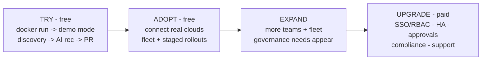
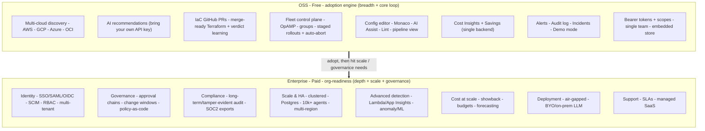

# Squadron — OSS GA bar + OSS-vs-Enterprise boundary (proposal)

_Drafted 2026-06-29 against `main` @ v0.89.291. A decision-support doc, not a
mandate: it proposes a finite "OSS is marketing-ready" checklist and a
recommended open-core boundary, and flags the few calls that are genuinely
yours to make._

## Strategic frame

Run the proven OSS-led playbook (Grafana / GitLab / dbt): give away a genuinely
useful OSS that creates the "wow," drive adoption + community, and monetize the
**organization-readiness** around it — scale, governance, compliance, support —
not the core value. The trap to avoid is "finish all gaps then start
enterprise": it's unbounded and tends to leak differentiators into OSS. Instead,
hit a *finite* GA bar, launch marketing, and scope enterprise in parallel.

The recommended bet: **keep the marquee discovery → AI → Terraform-PR loop and
the fleet/rollout control plane fully free**. That's the differentiated hook that
gets engineers to try it and tell their team. Monetize what teams need to run it
*at org scale, under governance, with a vendor on the hook*.

---

## Part 1 — OSS GA / "marketing-ready" checklist (finite)

The bar is "a skeptical SRE can self-serve a great first hour, and we're not
overclaiming." Most of this is already done.

```mermaid
flowchart LR
    subgraph DONE["Done - the product"]
        D1["Verified marquee paths"]
        D2["Headline pages render"]
        D3["Frictionless first-run"]
        D4["Honest coverage docs + auth"]
        D5["Perf / stability fixes"]
    end
    subgraph TODO["Remaining - mostly launch collateral"]
        R1["Public demo asset *"]
        R2["OSS-vs-paid page *"]
        R3["README known-limitations"]
        R4["Security one-pager"]
        R5["Community plumbing"]
        R6["CI headline smoke gate"]
    end
    DONE -.->|"* = highest leverage"| TODO
```

**Done**
- [x] Marquee paths verified live: multi-cloud discovery -> AI recs -> real
  GitHub PR; OTel fleet + staged rollouts; config editor; savings.
- [x] Headline pages render (browser-verified): Savings, Fleet Map, Config editor.
- [x] Frictionless first run: one-command `docker run`, single-port `:8080`,
  quickstart wizard, demo mode (no cloud account needed).
- [x] Honest detection-coverage matrix (`docs/detection-coverage.md`).
- [x] Auth model exists + documented (`docs/auth.md`): Bearer tokens + scopes,
  opt-in, loud "every endpoint is open" warning when disabled.
- [x] Performance/stability spot-fixes from the hardening pass (pipeline-health
  fleet query time-bound + retention GC).

**Remaining (the actual GA gating items)**
- [ ] **Public demo asset** — a hosted sandbox OR a polished 2–3 min recorded
  walkthrough of discovery -> AI rec -> PR. This is the #1 conversion asset and
  the biggest gap; the README marketing scenes are static.
- [ ] **"What's OSS vs paid" page** — set expectations up front (and tease
  enterprise). Prevents community surprise/backlash later. (Part 2 feeds this.)
- [ ] **README "known limitations"** — link the coverage matrix + the honest
  caveats (detection isn't uniform; cost projections are directional; AI is
  BYO-key). Lead-with-honesty earns SRE trust.
- [ ] **Security-posture one-pager for self-hosters** — "turn auth on before you
  expose it," network expectations, what data leaves the box (only the LLM call,
  only if you set the key). Mostly assembled from `docs/auth.md`.
- [ ] **Community plumbing** — CONTRIBUTING, issue/PR templates, a support
  channel (Discussions/Slack/Discord), and a clear "report a bug" path.
- [ ] **Headline-endpoint smoke gate in CI** — a thin check that the demo
  surfaces (savings, fleet, pipeline-health, discovery list) return 200 and a
  scan completes, so a regression like the 18s pipeline-health hang can't ship.

**Nice-to-have (not GA-gating)**
- [ ] Opt-in anonymous usage telemetry for adoption signal.
- [ ] A seeded "try it" dataset beyond demo mode for richer screenshots.

---

## Part 2 — Recommended OSS-vs-Enterprise boundary (open-core)

Principle: **breadth + the core loop = OSS; depth + scale + governance +
support = Enterprise.**

### Stays OSS (adoption engine — keep free)
- Multi-cloud discovery across **all four** clouds (AWS/GCP/Azure/OCI) —
  inventory + scanning. (Breadth is the wow; don't paywall a cloud.)
- AI recommendations (BYO `ANTHROPIC_API_KEY` — the user pays LLM cost).
- IaC GitHub remediation: merge-ready Terraform PRs, HCL-aware merge,
  `terraform validate` gate, verdict learning. (Marquee — keep free.)
- env -> Terraform import blocks.
- OTel fleet control plane: OpAMP, agents, groups, **staged rollouts with
  auto-abort**.
- Config editor + AI Assist + Squadron Lint + live pipeline view.
- Cost Insights + Savings (single-backend rate config; directional).
- Alerts, audit log (rolling/short retention), incidents drafter, demo mode.
- Single instance, embedded store (DuckDB/SQLite), single team, Bearer-token
  auth + scopes.

### Reserved / teased as Enterprise (org-readiness — monetize)
- **Identity & access**: SSO (SAML/OIDC), SCIM provisioning, full RBAC,
  multiple teams/projects, multi-tenancy. (OSS stops at bearer tokens + scopes.)
- **Governance**: rollout approval chains, change windows, mandatory-review
  enforcement, policy-as-code guardrails on what AI may propose/apply.
- **Compliance**: long-term + tamper-evident audit retention, SOC2 evidence
  exports, access reviews.
- **Scale & HA**: clustered/HA control plane, Postgres/managed store backends,
  10k+ agent fleets, multi-region.
- **Advanced detection**: the paid-telemetry-backed signals already deferred in
  OSS (Lambda Insights cold-start, App Insights Functions), anomaly/ML
  detection, deeper per-tier + more event-source-surface depth.
- **Cost at org scale**: showback/chargeback across teams, budgets + forecasting,
  multi-backend rate management, anomaly-based spend alerting.
- **Org-scale learning**: pooled verdict learning across teams + recommendation
  policy management.
- **Deployment options**: air-gapped, BYO/on-prem LLM, no-egress mode.
- **Premium connectors**: more IaC backends (GitLab/Bitbucket/Pulumi),
  ITSM/on-call (ServiceNow/PagerDuty), more cloud-tier depth.
- **Support & managed**: SLAs, dedicated support, hosted SaaS, onboarding services.

### The "tease list" for marketing (what excites SRE teams)
SSO + RBAC · rollout approval chains & change windows · fleet-scale HA ·
advanced cold-start/anomaly detection · org-wide cost showback + budgets ·
air-gapped / BYO-LLM · managed SaaS with SLAs.

---

## Part 3 — Decisions that are genuinely yours

1. **How much of the marquee loop stays free?** Recommendation: keep
   discovery -> AI -> PR fully free (uncapped clouds/PRs). Alternative: a soft
   cap (e.g., N connections or PRs/month) to create an upgrade trigger — but
   caps on the wow blunt adoption. Lean uncapped.
2. **Hosted SaaS now or later?** A hosted *demo* is a GA asset regardless; a
   paid hosted *product* is an enterprise lane you can stage after self-hosted
   adoption proves demand.
3. **LLM model**: BYO-key in OSS vs managed/BYO-on-prem model routing as
   enterprise. Recommendation: BYO-key OSS, managed/air-gapped LLM enterprise.
4. **Multi-cloud as a paywall?** Recommendation: no — all clouds free; depth and
   scale paid.

---

## Recommended sequencing

1. Close the finite GA checklist (the public demo asset + the OSS/paid page are
   the two highest-leverage items; the rest is light).
2. Publish the OSS-vs-paid page from Part 2 and start the marketing push.
3. In parallel, scope the top enterprise lane SREs ask for first (usually
   SSO+RBAC or rollout governance) and build the teaser into the marketing.
