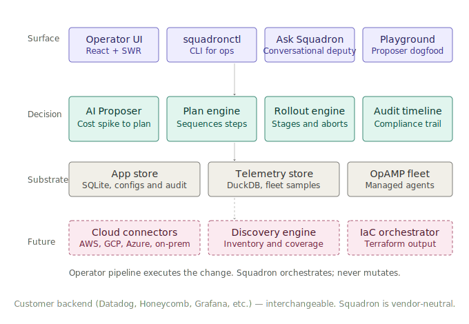

# Universal discovery — design

Last revised: drafting against v0.84.0 + post-thesis decisions.

## Decisions locked in this revision

Read these before any other section. The build-for-end-state
philosophy applies: architecture is generalized from day one;
implementation is sliced incrementally on top.

1. **Multi-account from day one.** The credential substrate
   schema uses `account_id` as primary key. The connect-account
   UI ships with multi-account support in slice 1.
2. **Multi-cloud connectors from day one (architecture).**
   `CloudConnection` type with `Provider` enum (`aws`, `gcp`,
   `azure`, `onprem`). `Scanner` interface with per-provider
   implementations. Slice 1 implements AWS only; slice 2 adds
   GCP by implementing the interface, not by reworking schema.
3. **On-prem posture from day one (architecture).**
   `CloudConnection.ConnectionType` enum (`api_discovered`,
   `agent_polled`, `manual_import`). Slice 6 implements
   `agent_polled`; the type lives in the schema from slice 1.
4. **Secrets backend pluggable from day one.** Credential
   substrate exposes a `SecretsBackend` interface. SQLite is the
   OSS default. Vault / AWS Secrets Manager / GCP Secret Manager
   land as Compliance Pack implementations.
5. **Multi-region scans from day one (architecture).** The
   `Scanner` interface takes a list of regions. Slice 1 ships
   with operator-selected single region per scan; slice 3
   extends to scheduled multi-region. The interface doesn't
   change between slices.
6. **IaC format: Terraform-first implementation, multi-format
   architecture.** Recommendation payload carries an
   `iac_format` field from day one. Proposer prompt accepts
   `iac_format` as a parameter. Slice 1 fills Terraform only;
   slice 7 adds CDK and Pulumi by template, not by rework.
7. **Recommendation surface: shared between JARVIS and
   discovery.** The v0.66 recommendations engine carries a
   typed `Source` (`cost_spike` / `discovery_scan` / `manual`)
   and a typed `Action` payload (`rollout` / `plan` /
   `discovery_action`). Same UI, same audit, same Ask Squadron
   citation.
8. **Canonical demo scenario: `container.id` + `k8s.pod.uid`.**
   The v0.79 prompt example, LinkedIn rollout doc table, bench
   corpus, and playground starter all reference the same
   scenario. No drift.
9. **Multi-tenancy: held.** Single-tenant in OSS. Tenant
   isolation arrives when the managed offering is real.
10. **Connector workflows are foolproof or release-blocked.**
    See the "Connector workflow design" section below — the
    eleven principles are non-negotiable.

This is the architecture document for Squadron's universal discovery
arc. It exists so anyone reading the codebase, reviewing the security
posture, or pulling on a parallel build stream can answer "how is
this supposed to work" without reading code first.

The document gates every implementation session in the discovery arc.
When a code change fights this design, the change either restructures
to fit or the design doc gets updated with a written rationale.

Companion reading:
- `docs/thesis.md` — the strategic foundation. The "we do not" list
  there is load-bearing for every choice here.
- `docs/ai-features.md` — the existing proposer architecture this
  reuses.
- `docs/proposer-bench.md` — the calibration discipline pattern this
  inherits.

## Slice 1 scope contract

What ships in the first AWS discovery release, called out explicitly
so scope creep is visible and refusable.

**In scope:**
- Connect ONE AWS account via IAM assume-role
- Scan EC2 instances and Lambda functions in ONE region per scan
- Read-only discovery — `ec2:Describe*`, `lambda:List*`,
  `lambda:GetFunction*`. No write actions in the trust policy.
- Persist inventory to a new `inventory_aws` store
- Emit AI recommendations as Terraform snippets per step
- Render the recommendations in a new `/discovery/aws` UI page
- Audit every scan, recommendation, and operator action

**Explicitly out of scope for slice 1:**
- Multi-account connections (single account at MVP; slice 3)
- Multi-region per scan (single region at MVP; slice 3)
- Other AWS service types — RDS (slice 2, shipped v0.87), S3 + ALB
  (slice 3a, shipped v0.88.0 — paired because ALB access logs target
  S3 buckets, so the proposer's cross-reference value of recommending
  an ALB enable logs to a bucket Squadron already sees in the
  inventory justified the paired ship), EKS (slice 3b, planned
  v0.89.0 — ships standalone because of the cluster-shape snapshot,
  the composite instrumented rule, and the dedicated LinkedIn
  narrative beat), ECS / Fargate (later slice, parked)
- GCP, Azure, on-prem (slice 4, 5, 6)
- Multi-format IaC — CDK, Pulumi, CloudFormation (slice 7)
- Remediation posture — anything where Squadron has write permissions
  to the customer's cloud (post-slice-6, behind Compliance Pack).
  Specifically: Squadron does NOT execute `rds:ModifyDBInstance`
  even though slice 2 RDS recommendations propose enabling PI / EM;
  the operator runs the Terraform through their own IaC pipeline.
- Squadron-initiated mutations of customer cloud resources, ever, in
  any slice

The "explicitly out of scope" list is the design's escape hatch
against feature pressure. When someone asks "can we also scan RDS in
slice 1," the answer is "no, that's slice 2." When someone asks "can
the recommendation auto-apply if the operator clicks Approve," the
answer is "no, that's a thesis violation."

## Architecture at a glance

Where the discovery tier slots into Squadron's existing control
plane. The Surface, Decision, and Substrate tiers are real today
at v0.84.0. The Future tier is what slice 1 ships into.

<p align="center">

</p>

The IaC orchestrator is the load-bearing component. Recommendations
emit Terraform snippets that the operator's existing pipeline
runs. Squadron never executes cloud mutations directly. The action
runner stays on its v0.55 VM-daemon model; cloud changes route
through customer IaC. The two paths never merge.

## Security architecture

The security posture is the single most important part of this
design. If we get this wrong, no enterprise will adopt Squadron for
discovery regardless of how good the recommendations are.

### IAM trust policy

The customer creates an IAM role in their AWS account. The role's
trust policy looks like:

```json
{
  "Version": "2012-10-17",
  "Statement": [
    {
      "Effect": "Allow",
      "Principal": {
        "AWS": "arn:aws:iam::<SQUADRON_AWS_ACCOUNT>:role/SquadronDiscovery"
      },
      "Action": "sts:AssumeRole",
      "Condition": {
        "StringEquals": {
          "sts:ExternalId": "<DEPLOYMENT_SPECIFIC_UUID>"
        }
      }
    }
  ]
}
```

`SQUADRON_AWS_ACCOUNT` is the account hosting the Squadron deployment
(for OSS self-hosted, this is the operator's own account; for a
future managed service, it's the operator's account at the SaaS
provider). `DEPLOYMENT_SPECIFIC_UUID` is generated at first connect
and stored in Squadron's encrypted credential substrate (see below).

The `ExternalId` condition is non-negotiable. Without it, the
customer's trust policy is vulnerable to the
[confused deputy problem](https://docs.aws.amazon.com/IAM/latest/UserGuide/confused-deputy.html)
— another Squadron customer could potentially assume into this
role if they discovered the role ARN. The `ExternalId` is the
shared secret that proves the assume-role request originated from
the specific Squadron deployment the customer authorized.

### Permissions policy (slice 1 + slice 2 + slice 3a + slice 3b)

The role's permissions policy is strictly read-only. Slice 1 covered
EC2 + Lambda (9 actions); slice 2 (v0.87) added RDS as the third
service Squadron walks (1 action); slice 3a (v0.88.0) added S3 (5
actions) and ELBv2 / ALB / NLB (3 actions); slice 3b (v0.89.0) adds
EKS (5 actions), bringing the total to 22 read-only actions. The
slice 3b policy:

```json
{
  "Version": "2012-10-17",
  "Statement": [
    {
      "Effect": "Allow",
      "Action": [
        "ec2:DescribeInstances",
        "ec2:DescribeInstanceStatus",
        "ec2:DescribeRegions",
        "ec2:DescribeTags",
        "lambda:ListFunctions",
        "lambda:GetFunction",
        "lambda:GetFunctionConfiguration",
        "lambda:ListTags",
        "rds:DescribeDBInstances",
        "s3:ListAllMyBuckets",
        "s3:GetBucketLocation",
        "s3:GetBucketLogging",
        "s3:GetBucketTagging",
        "s3:GetBucketRequestPayment",
        "elasticloadbalancing:DescribeLoadBalancers",
        "elasticloadbalancing:DescribeLoadBalancerAttributes",
        "elasticloadbalancing:DescribeTags",
        "eks:ListClusters",
        "eks:DescribeCluster",
        "eks:ListAddons",
        "eks:DescribeAddon",
        "eks:ListNodegroups"
      ],
      "Resource": "*"
    }
  ]
}
```

No `*:Update*`. No `*:Modify*`. No `*:Create*`. No `*:Delete*`. No
`*:Put*`. No `iam:*`. The principle of least privilege is enforced
at the policy level so even a fully compromised Squadron cannot
escalate to write actions.

Slice 2's `rds:DescribeDBInstances` returns the per-instance
Performance Insights flag and the Enhanced Monitoring interval that
drive the proposer's RDS recommendations. The proposer surfaces
ENABLEMENT recommendations as plan steps — Terraform that calls
`aws_db_instance.performance_insights_enabled = true` /
`aws_db_instance.monitoring_interval = 60`. **Squadron does NOT
execute the `rds:ModifyDBInstance` call**; the operator runs the
Terraform through their own IaC pipeline. The discovery role's
permissions policy never grants `rds:ModifyDBInstance` — the
read-only invariant holds.

Slice 3a's S3 actions return per-bucket Server Access Logging state
(`s3:GetBucketLogging`), per-bucket tags (`s3:GetBucketTagging`),
per-bucket region (`s3:GetBucketLocation`), and request-payer
configuration (`s3:GetBucketRequestPayment`). `s3:ListAllMyBuckets`
returns BUCKET NAMES (metadata, not contents). No action in the
slice 3a policy returns object data, object metadata, ACL entries,
or any data inside a bucket. The proposer surfaces enablement
recommendations as plan steps — Terraform that calls
`aws_s3_bucket_logging.target_bucket` / `target_prefix` with an
operator-chosen bucket. **Squadron does NOT execute
`s3:PutBucketLogging`**.

Slice 3a's ELBv2 actions return per-LB type / scheme
(`elasticloadbalancing:DescribeLoadBalancers`), per-LB access-logs
attribute (`elasticloadbalancing:DescribeLoadBalancerAttributes`),
and per-LB tags (`elasticloadbalancing:DescribeTags`). The
`access_logs.s3.bucket` attribute is operator-chosen CONFIG, not
the log contents — Squadron never reads the actual access-log
files. The proposer surfaces enablement recommendations as plan
steps — Terraform that calls `aws_lb.access_logs.bucket` /
`enabled = true` with an operator-chosen target bucket (preferring
an existing instrumented bucket from the same scan when possible,
per the ALB→S3 cross-reference rule documented in the proposer
prompt). **Squadron does NOT execute
`elasticloadbalancing:ModifyLoadBalancerAttributes`**.

Squadron's discovery code path explicitly never calls any of
the following AWS write APIs:

- `rds:ModifyDBInstance`
- `s3:PutBucketLogging`
- `elasticloadbalancing:ModifyLoadBalancerAttributes`
- `eks:UpdateCluster` / `eks:CreateAddon` / `eks:DeleteCluster` / `eks:Update*`
- `ec2:RunInstances` / `ec2:Terminate*` / `ec2:Modify*`
- `lambda:UpdateFunctionConfiguration` / `lambda:Update*`
- any `iam:*` action

Slice 3b's EKS actions return cluster metadata only:
`eks:ListClusters` returns cluster NAMES (one identifier per
cluster, no contents); `eks:DescribeCluster` returns the
control-plane logging config + Kubernetes version + status + ARN
+ tags + endpoint URL (the URL is metadata, not access — Squadron
never connects to the K8s API); `eks:ListAddons` returns add-on
NAMES; `eks:DescribeAddon` returns add-on version + status;
`eks:ListNodegroups` returns nodegroup NAMES (informational count
only — Squadron does not read instance details, pod state, or any
in-cluster runtime data). The discovery role does NOT get
Kubernetes RBAC, does NOT use `aws-auth` ConfigMap mappings, does
NOT call any K8s API, and does NOT see pod data, K8s secrets, or
any in-cluster runtime state. The threat surface is strictly the
AWS-side cluster metadata. The proposer surfaces enablement
recommendations as plan steps — Terraform that calls
`aws_eks_cluster.enabled_cluster_log_types` and
`aws_eks_addon`. **Squadron does NOT execute `eks:UpdateCluster`
or `eks:CreateAddon`**.

Each future slice expands this policy by additional
Describe/List/Get actions only. The "no write actions" invariant
holds across every slice. If a future slice ever needs write
actions, that's a fundamentally different posture (the remediation
posture, gated behind Compliance Pack) and gets its own role, ARN,
audit trail, and threat model.

### STS token lifecycle

Squadron never stores AWS credentials at rest. The flow:

1. At connect time, Squadron validates the trust policy by calling
   `sts:AssumeRole` against the customer's role ARN with the
   deployment's ExternalId. If the assume succeeds, the trust is
   recorded. If it fails, the operator sees the AWS error verbatim
   and re-attempts with corrected configuration.
2. The assume returns short-lived credentials (default 1-hour TTL).
   These live in memory only. If the credentials expire mid-scan,
   the scan engine re-assumes silently.
3. Scan completes; in-memory credentials are dropped.
4. Next scan re-assumes from scratch.

No long-lived access keys are ever issued to Squadron by the
customer. No `aws_access_key_id` or `aws_secret_access_key` fields
exist in the Squadron schema. If a future contributor tries to add
them, the contribution is rejected.

### Credential substrate

The encrypted-at-rest substrate Squadron uses to store:
- The customer's AWS role ARN (not a secret per se, but identifies
  the target account)
- The deployment's ExternalId (effectively a secret — must not leak)
- Per-account metadata (display name, region, opt-in service types)

What it stores: Trust-policy metadata. Not credentials.

What it does NOT store: AWS access keys, AWS secret keys, STS
tokens, customer telemetry, customer business data.

The substrate uses AES-256-GCM at rest with a key derived from
`SQUADRON_SECRETS_KEY` (env var, operator-managed). For OSS
deployments where the operator controls both the Squadron host and
the secrets key, this is sufficient. For managed deployments (out
of slice 1 scope), the substrate plugs into the customer's
preferred secrets manager (Vault, AWS Secrets Manager, GCP Secret
Manager) — that's its own design decision (see "Decision points"
below).

Audit log: every read of the substrate (when Squadron assumes a
role) is recorded as a `discovery.role_assumed` audit event. Even
the trust-policy ARN reads are logged. The substrate has no
unaudited read path.

### Compliance Pack hardening (private repo, optional)

The OSS edition ships the substrate with reasonable defaults. The
Compliance Pack adds enterprise hardening:

- STS token TTL reduced from 60 minutes to 15 minutes
- Role assumption requires a change-ticket reference in the audit
  payload
- Substrate decryption requires HSM-backed key (not env var)
- Cross-region scan operations require explicit per-region opt-in
- The `discovery.recommendation_marked_applied` event requires a
  reviewer attestation field

The hooks for these hardenings exist in the OSS code; the
implementations live in the Compliance Pack private repo. The OSS
edition is fully functional without the Compliance Pack — the
hardenings are policy enforcement, not features.

## Threat model

What's the blast radius at each posture? This section is the
honest answer to the security review question "what happens if
Squadron is compromised."

### Posture: Discovery role only (slice 1 + slice 2 + slice 3a + slice 3b)

If an attacker compromises a Squadron deployment and the only IAM
role connected is the discovery role:

**The attacker can:**
- Enumerate EC2 instances, Lambda functions, RDS DB instances, S3
  buckets, and ALB / NLB / GWLB load balancers in the connected
  region(s) of the connected account
- Read instance metadata, security group references, tags
- Read Lambda function configuration including environment variable
  KEYS (not values — `lambda:GetFunctionConfiguration` returns
  variable names but redacts values for sensitive content)
- Read RDS DB instance metadata: engine + version, instance class,
  Performance Insights / Enhanced Monitoring enablement flags, tags.
  `rds:DescribeDBInstances` does NOT return endpoint credentials,
  master passwords, or any data inside the database.
- Read S3 bucket NAMES (`s3:ListAllMyBuckets`), per-bucket region
  (`s3:GetBucketLocation`), per-bucket Server Access Logging
  CONFIGURATION (`s3:GetBucketLogging` returns the logging target
  bucket and prefix, NOT the log contents), per-bucket tags
  (`s3:GetBucketTagging`), and per-bucket request-payer
  configuration (`s3:GetBucketRequestPayment`). The slice 3a S3
  permissions never return object data, object metadata, ACL
  entries, or any data inside a bucket.
- Read load balancer metadata (name, ARN, type, scheme, region —
  `elasticloadbalancing:DescribeLoadBalancers`), per-LB attributes
  including the access-logs configuration
  (`elasticloadbalancing:DescribeLoadBalancerAttributes` returns
  the operator-chosen target S3 bucket for the access logs — this
  is CONFIG, not the log contents themselves), and per-LB tags
  (`elasticloadbalancing:DescribeTags`).

**The attacker cannot:**
- Modify anything in the customer's AWS account (no
  `rds:ModifyDBInstance`, no `s3:PutBucketLogging`, no
  `elasticloadbalancing:ModifyLoadBalancerAttributes`, no
  `ec2:RunInstances`, no `lambda:UpdateFunctionConfiguration` —
  the policy is strictly Describe/List/Get)
- Read EC2 instance memory, disk, or network traffic
- Read Lambda function code (would require `lambda:GetFunction` to
  fetch the deployment package — included in slice 1 because the
  proposer reasons about runtime versions, but the package itself
  is not exfiltrated; only the package URL is read)
- Escalate to other AWS accounts (ExternalId is deployment-specific)
- Issue AWS API calls that cost money beyond Describe/List/Get
- Persist access beyond the STS token TTL

**The honest data leakage:**
- Resource names (instance tags, function names) — can be
  PHI/PII in regulated environments (e.g., "patient-records-db")
- Resource counts and shapes — competitive intelligence value
- Region presence — reveals customer's geographic footprint

**Mitigation:** Compliance Pack adds (1) HSM-backed substrate so a
host compromise doesn't leak the ExternalId, and (2) per-region
scan opt-in so a compromised Squadron cannot autonomously scan all
regions even if it has the role.

### Posture: Discovery + future remediation role (post-slice-6)

The remediation posture is OUT OF SLICE 1 SCOPE but addressed here
so the design accounts for it from the start.

Remediation, if ever shipped, will have:
- A separate IAM role with a separate trust policy
- A separate ExternalId
- Write permissions scoped to specific resource ARNs only
  (e.g., `lambda:UpdateFunctionConfiguration` scoped to specific
  function ARNs the operator opted in)
- Per-action operator approval enforced server-side
- Compliance Pack gating by default

The remediation role's credentials never flow to the discovery code
path. The two postures are isolated such that a compromised
discovery code path cannot escalate to remediation, even at the
process level. This is enforced by:

- Separate credential substrates (separate encryption keys)
- Separate code modules (`internal/discovery/aws` vs
  `internal/remediation/aws` — different packages, no import
  arrow between them)
- Separate audit categories (`discovery.*` vs `remediation.*`)
- Separate API surfaces (`/api/v1/discovery/*` vs
  `/api/v1/remediation/*`)

This separation is non-negotiable. If a future refactor proposes
merging them, the refactor is rejected.

### Threat: malicious recommendation injection

A novel threat the proposer pattern introduces: an attacker who
controls the prompt or context (e.g., via a compromised audit
event or a poisoned inventory record) could potentially get the
AI to emit a malicious Terraform snippet.

**Mitigation:**
- Every Terraform snippet emitted by the proposer is sanitized
  server-side before display: validated as parseable HCL, scoped to
  resource types the slice allows, no `provider` block override
  (the operator's existing IaC posture controls the provider).
- The operator-in-the-loop is the last line of defense: snippets
  display in the UI with full preview, no auto-apply, the
  operator runs them through their own IaC pipeline which has its
  own approval/review.
- The proposer playground (v0.84) acts as a sandbox where snippets
  can be inspected without any execution path.

A "fully compromised proposer outputs malicious Terraform that the
operator pastes into their IaC pipeline" attack still requires the
operator to consciously run unreviewed code. That's a social
engineering attack, not a system architecture failure. The design
makes the snippet visible; review is the operator's responsibility.

## Action runner separation contract

The most important section. This is the contract that keeps the
discovery arc from poisoning the rest of Squadron's security
posture.

**Squadron does NOT call cloud-mutating APIs from the discovery
code path.**

The action runner system (v0.55) targets registered daemons on
VMs the customer has explicitly registered. Daemons receive
OpAMP-signed dispatch envelopes and execute scoped actions
(restart service, drain queue, etc.) on the VM they own.

The discovery arc does NOT extend the action runner to cover cloud
APIs. Cloud-mutating actions, when they become a feature, go
through the customer's existing IaC pipeline:

- Squadron emits Terraform/CDK/Pulumi snippets
- The customer pastes them into their IaC pipeline (Terraform Cloud,
  GitHub Actions, CodePipeline, etc.)
- Their pipeline has its own auth, audit, review, rollback
- Squadron records the recommendation as "marked applied" when the
  operator says so

The action runner stays on the VM model. Cloud changes stay on the
IaC model. The two never merge. If a customer wants Squadron to
"automatically install the OTel layer on these 47 Lambdas," the
answer is "here's the Terraform; your pipeline runs it."

This contract is the single most important reason an enterprise
security team will approve Squadron. Without it, Squadron is "the
AI tool with prod cloud keys" and gets blocked. With it, Squadron
is "the recommendation engine that orchestrates with our existing
infrastructure-as-code workflow" and gets approved.

## The CloudDiscoveryContext shape

Mirrors `ai.CostSpikeContext`. The proposer pattern carries with
minimal new code — same shape, new entry point. Provider-typed
at the top level; resources are category-typed underneath so the
same prompt reasons about compute / function / database
regardless of which cloud emitted them.

```go
type CloudDiscoveryContext struct {
    // Identification
    ScanID        string
    ScanStartedAt time.Time
    Provider      Provider  // aws, gcp, azure, onprem
    AccountID     string    // account (aws), project (gcp), subscription (azure), site (onprem)
    Regions       []string  // multi-region native; slice 1 emits one entry

    // Inventory snapshot — category-typed, not provider-typed
    ComputeInstances []ComputeInstanceSnapshot   // ec2 / gce / azure vm / vmware vm
    FunctionRuntimes []FunctionRuntimeSnapshot   // lambda / cloud functions / azure functions
    Databases        []DatabaseSnapshot          // rds / cloud sql / azure sql  (slice 2+)
    LoadBalancers    []LoadBalancerSnapshot      // alb / gclb / azure lb       (slice 2+)
    ObjectStores     []ObjectStoreSnapshot       // s3 / gcs / blob             (slice 2+)

    // Coverage assessment
    InstrumentedCount   int  // resources with OTel detected
    UninstrumentedCount int  // resources without

    // Customer context (helps the proposer reason)
    PreferredBackend  string   // "datadog" / "honeycomb" / "grafana" / "selfhosted"
    PreferredIaCFormat string  // "terraform" / "cdk" / "pulumi"  -- slice 1: terraform only
    PreferredRegions  []string // for collector colocation
}

type ComputeInstanceSnapshot struct {
    ResourceID   string             // ec2 instance id / gce instance name / azure vm id
    InstanceType string             // provider-specific shape, e.g. m5.large or n2-standard-4
    Tags         map[string]string  // provider tags, normalized
    HasOTel      bool               // detected via tag or process heuristic
    OSFamily     string             // "linux" / "windows" / "unknown"
}

type FunctionRuntimeSnapshot struct {
    ResourceID   string  // arn (aws) / function id (gcp) / function name (azure)
    Name         string
    Runtime      string  // "nodejs20" / "python3.11" / "go1.21" / etc.
    HasOTelLayer bool    // provider-specific detection (aws layer, gcp lib, azure extension)
}
```

Provider-specific scanners populate the snapshot structs from their
native APIs. The proposer prompt reasons about categories, not
provider-specific resource types — same plan-kind output, IaC
snippets targeted to the source provider.

The proposer takes this and emits a `ProposalResult` with `Kind:
"plan"` where each plan step is "instrument these N resources via
this method." Each step carries an additional `IaCSnippet` field
the v0.66 recommendations engine renders.

The proposer prompt for discovery is a sibling of the proposer
prompt for cost spikes. Same decision-framework discipline (when
to emit a single step vs a multi-step plan), same JSON contract,
same `mode:"percent"` constraint that v0.81.2 hardened.

## Recommendation surface

UI: new `/discovery/aws` route. Three tabs:

**Account tab.** Connected AWS accounts with status indicators.
Connect-new flow walks the operator through:
1. Display the trust policy JSON they need to paste into AWS
2. Display the role ARN field for them to fill in
3. Display the ExternalId Squadron generated for them
4. Test-connect button that validates assume-role
5. On success, role is recorded; first scan kicks off

**Inventory tab.** Latest scan's resources, grouped by service
type. Shows instrumentation status (OTel detected vs not) and
last-scan timestamp. Operator can trigger re-scan from here.

**Recommendations tab.** AI-emitted recommendations from the latest
scan, rendered using the v0.66 recommendations engine extended with
IaC snippet panels. Each recommendation step has:
- Title and reasoning (mirrors the proposer playground v0.84
  result-panel patterns)
- Affected resources (linked from the inventory tab)
- IaC snippet — Terraform code block with syntax highlighting
- "Copy snippet" button
- "Mark as applied" button (records audit event; does NOT execute)
- "Reject" button (records audit event; recommendation is dismissed)

The recommendations tab reuses every UX pattern v0.84 proved out
in the proposer playground. The operator's mental model is
"this is the proposer, applied to my cloud account."

## Connector workflow design

The connector setup experience is the first ten minutes an SRE
spends with Squadron. Get it wrong and the universal-observation
thesis stalls at the front door — no amount of downstream feature
quality recovers a bad first impression. Get it right and the
LinkedIn drumbeat writes itself.

**Load-bearing constraint:** every connector workflow is guided
step-by-step with one action per step, copy-to-clipboard for every
Squadron-generated value, real-time validation, a test-before-commit
step, and humanized error messages naming recovery actions. If a
user can misconfigure a connector by following the wizard, the
wizard is broken — treat it as a release-blocking bug, not a polish
issue.

### The eleven principles

1. **Guided multi-step wizard with explicit progress.** One action
   per step. Visual progress bar. User always knows where they are.
2. **Copy-to-clipboard for every Squadron-generated value.** Trust
   policy JSON, ExternalId, role ARN format — all one-click.
3. **Pre-filled values wherever possible.** The trust policy JSON
   ships with the customer's AWS account ID and the deployment's
   ExternalId already inserted. User pastes verbatim.
4. **Inline deep-links to the exact provider console page.** Not
   the IAM home — the role creation flow itself.
5. **Real-time client-side validation.** Role ARN format, region
   list, ExternalId length. Errors appear inline, not after submit.
6. **Test-before-commit step.** A "Validate connection" button runs
   `sts:AssumeRole` (or provider equivalent), returns the result,
   creates no records. Save lands only after validation passes.
7. **Decoded error messages with recovery guidance.** Parse every
   provider error code. `AccessDenied` becomes "the role exists but
   doesn't trust Squadron's principal; did you paste the trust
   policy from Step 2?" Each error names the recoverable step.
8. **Idempotent retry at any step.** Fix one field and retry — no
   duplicate records, no orphaned half-configured connections.
9. **"What just happened" confirmation panel.** Concrete evidence
   on success: "Trust policy validated. EC2 test scan succeeded —
   47 instances visible in us-east-1. Lambda test scan succeeded —
   12 functions visible." Shareable with the security reviewer.
10. **Inline "why this step?" docs panel.** Every step has a
    collapsible explainer answering the question the SRE's security
    reviewer will ask. The ExternalId step explains confused deputy
    in three sentences.
11. **Provider-specific wizard, shared component framework.** AWS,
    GCP, Azure, on-prem each have their own step content; they all
    use the same multi-step shell + copy helpers + deep-link helpers
    + validation helpers + error-humanization layer.

### Architecture

Wizard definitions are declarative. Each provider exports a
`ConnectorWizard` value:

```go
type ConnectorWizard struct {
    Provider       Provider
    Title          string
    Steps          []WizardStep
    ValidateFn     func(ctx context.Context, draft Draft) (*ValidationResult, error)
    PersistFn      func(ctx context.Context, draft Draft) (*CloudConnection, error)
}

type WizardStep struct {
    ID             string
    Title          string
    Description    string
    Action         WizardAction // CopyValue / FillField / DeepLink / TestConnection
    ActionPayload  any
    Validation     ValidationRule
    DocLink        string  // "why this step?"
    RecoveryHint   string  // shown when a later step fails citing this one
}
```

The UI consumes the declarative wizard via a single React component
that handles steppers, copy buttons, deep-links, inline validation,
the test-before-commit flow, and the "what just happened" panel.
Adding a new provider is shipping a new `ConnectorWizard` value plus
provider-specific code for `ValidateFn` and `PersistFn`. No new
React components.

### Validation endpoint

The test-before-commit step calls a first-class API:

```
POST /api/v1/discovery/{provider}/validate
{
  "draft": { ...provider-specific fields... }
}
=>
{
  "assume_role_ok": true,
  "scan_preflight": [
    {"service": "ec2", "ok": true, "sample_count": 3},
    {"service": "lambda", "ok": true, "sample_count": 1}
  ],
  "errors": []
}
```

Zero records are created. The UI renders this response as the
"what just happened" panel pre-commit, then prompts Save.

### Error humanization layer

Each provider implements `HumanizeError(error) HumanizedError`:

```go
type HumanizedError struct {
    Code           string  // provider's raw code
    Message        string  // human prose
    SuggestedStep  string  // ID of the wizard step to return to
    DocLink        string  // optional deeper context
}
```

AWS errors live in `internal/discovery/aws/errors.go`. GCP in
`internal/discovery/gcp/errors.go`. The UI renders the humanized
error verbatim — no client-side error parsing.

### Release-blocking criteria

A connector ships only when:

- A new operator who has never used Squadron can complete the
  connect-account flow in under 5 minutes following the wizard
  alone (no external docs needed).
- Every distinct provider error code observed during testing has
  a humanized message naming the recoverable step.
- The "what just happened" panel renders concrete inventory
  evidence the operator can show to their security reviewer.

If any of these fails, the slice does not ship. Polish later is
not an option — connector setup is the first impression, and first
impressions don't get a v0.X.1 hotfix to fix them.

## Audit trail invariants

New event types:

- `discovery.account_connected` — operator approves a new AWS account
- `discovery.role_assumed` — Squadron successfully assumed the role
  for a scan (creds remain in memory)
- `discovery.scan_started` — scan begins
- `discovery.scan_completed` — scan ends, includes resource counts
- `discovery.scan_failed` — scan failed, includes error
- `discovery.recommendation_generated` — AI emitted a recommendation
- `discovery.recommendation_marked_applied` — operator says they ran
  the IaC
- `discovery.recommendation_rejected` — operator dismissed a
  recommendation

Each has a humanized rendering in v0.81.4's timeline humanizer.
Each is queryable via the existing audit API. Each carries the
account_id + scan_id so an auditor can reconstruct any scan's full
lifecycle from the audit log alone.

## Failure modes

What happens when things go wrong. Every failure mode listed here
must have an explicit operator-visible behavior, not a silent
failure.

- **Squadron crashes mid-scan.** `scan_started` exists with no
  `scan_completed`. UI shows "scan in progress" until a 10-minute
  timeout, then "scan failed (squadron unavailable)" — auto-retry
  scheduled.
- **Customer revokes the IAM role mid-scan.** AWS calls fail with
  `AccessDenied`. Scan emits `scan_failed` audit event with the
  AWS error verbatim. UI shows actionable error: "the role
  `<arn>` is no longer assumable; re-validate the trust policy."
- **AWS rate-limits a large account.** Pagination + exponential
  backoff. If `Throttling` errors persist > 30 minutes, scan emits
  `scan_completed` with `partial: true` flag and a per-service
  count of "resources scanned" vs "resources skipped." Operator
  sees the partial scan as a yellow status; can re-scan to fill
  gaps.
- **AI proposer fails to generate recommendations.** Same handling
  as v0.82's `#550` truncation path: bridge logs the failure,
  scan completes with `recommendations_generated: 0`, operator
  sees "scan complete, no recommendations" with link to the AI
  failure detail.
- **Recommendation rejected.** Nothing happens beyond the audit
  event. Re-running the scan may re-generate the same
  recommendation (the proposer doesn't remember rejections in
  slice 1 — that's Arc B / proposer memory loop).
- **Recommendation accepted but customer's IaC pipeline fails.**
  Squadron has no way to know directly. Operator can un-mark the
  recommendation; the audit event becomes
  `recommendation_marked_applied` followed by
  `recommendation_marked_unapplied`. Future slices might add IaC
  pipeline integration to close this loop, but that's not slice 1.

## Phased rollout for the discovery arc

The discovery arc itself is multi-slice. Each slice is
independently useful and ships separately.

| Slice | Scope | Independent value |
|-------|-------|-------------------|
| 1 | AWS, EC2 + Lambda, read-only, Terraform | "Squadron tells me which Lambdas I'm not observing" |
| 2 | AWS adds RDS, S3, ALB | "Same, for managed services" |
| 3 | AWS multi-region + multi-account | "Org-wide AWS coverage" |
| 4 | GCP — Compute Engine + Cloud Functions | "Multi-cloud" |
| 5 | Azure — VMs + Functions | "Three clouds" |
| 6 | On-prem connector | "Hybrid" |
| 7 | Multi-format IaC: CDK, Pulumi, CloudFormation | "Vendor flexibility" |
| 8 | Remediation posture (opt-in, Compliance Pack gated) | "Squadron also applies" |

Slip the timeline; do not skip the slices. Discovery becomes the
thesis-validating arc only when slice 6 ships ("no blind spots
anywhere"). Each prior slice must work on its own merits because
adopters will arrive at every stage.

## Decision points

These need answers before code lands. The design surfaces them;
the operator/strategist calls them.

**1. Credential storage.** Squadron's own encrypted DB (AES-256-GCM
with key from `SQUADRON_SECRETS_KEY`) or delegate to the
operator's preferred secrets manager (Vault, AWS Secrets Manager,
GCP Secret Manager)?

*Design proposal:* Own DB for OSS slice 1. The substrate has a
clean interface; Compliance Pack adds the secrets-manager plugins
in a later slice. Single-binary-deployable matters for OSS
adoption.

**2. Multi-account at MVP.** Single-account-only at slice 1
(simpler, ships faster), or multi-account from day one (more
realistic for enterprise but requires migration if we ship single
first)?

*Design proposal:* Single-account at slice 1. The connection record
schema includes an `account_id` column from the start so migration
to multi-account in slice 3 is additive, not breaking.

**3. IaC output format.** Terraform-only at slice 1, or
Terraform + CDK + Pulumi from day one?

*Design proposal:* Terraform-only. Highest adoption in the target
audience (SREs at series B-D). CDK and Pulumi come in slice 7. The
proposer prompt is designed so the IaC format is a parameter, not
a structural assumption — adding formats later is additive.

These three defaults all bias toward "ship slice 1 sooner; expand
later." If the strategic call is "we want to land enterprise from
day one," all three defaults flip and slice 1 takes ~2x longer.

## What this design unlocks for parallel build

Section for the orchestrator (Stream 1 main session) to use when
fanning out work to sub-agents.

**Stream 2A — Credential substrate (post-design-doc, sub-agent).**
- New package `internal/discovery/credstore`
- Encrypted-at-rest storage for AWS role ARN + ExternalId
- Audit-event emission on every read
- Tests for encryption roundtrip + tamper detection
- Spec: this design section "Credential substrate" + "Decision
  point #1 default"

**Stream 2B — Recommendation surface generalization (post-design-doc,
sub-agent).**
- Extend `internal/services/recommendations.go` to accept an
  optional `IaCSnippet` field per recommendation step
- Extend the UI's recommendations panel to render the snippet with
  copy button and syntax highlighting
- Tests for the new field's marshal/unmarshal
- Spec: this design section "Recommendation surface"

**Stream 2C — AWS SDK integration scaffold (post-credential
substrate, sub-agent).**
- New package `internal/discovery/aws`
- `sts:AssumeRole` wrapper that uses the credential substrate
- EC2 + Lambda Describe/List wrappers with pagination + backoff
- No proposer logic yet — just inventory fetch
- Spec: this design section "STS token lifecycle" +
  "Permissions policy (slice 1)"

**Stream 2D — Connector wizard framework (post-2C validation
endpoint, sub-agent).**
- New package `internal/discovery/wizard` with the declarative
  `ConnectorWizard` + `WizardStep` types
- AWS `ConnectorWizard` value populated with the 5-step AWS flow
  (Account ID → Trust policy → Role ARN → Validate → Save)
- React component `<ConnectorWizard />` consuming any wizard
- AWS `errors.go` with humanization for common assume-role errors
- Tests: every wizard step has a unit test for its validation rule;
  the React component has a Vitest test for the happy path and one
  error-path scenario
- Spec: this design section "Connector workflow design"

**Stream 3 — Independent track (any time, sub-agents).**
- LinkedIn Phase 1 drafting (docs only, no code)
- LinkedIn Phase 1 posts 4-8 (Bench, Playground, Audit timeline,
  Two-person rule, E2E sweep recap — agent surfaced these candidates)
- #547 agent citations investigation
- #554 server-side plans-list endpoint
- Canonical demo scenario sync (update v0.79 prompt example,
  rollout doc table, posts to use `container.id` / `k8s.pod.uid`)

Stream 1 in the main session handles the work that stitches these
together: the proposer prompt for discovery, the
`CloudDiscoveryContext` definition, the `/discovery/{provider}` UI
page that hosts the wizard, the audit-event wiring. These are
decisions, not implementations, so they stay with the orchestrating
session.

## Constraints this design imposes

Until this document is rewritten, the following are non-negotiable:

- Squadron does not call cloud-mutating APIs from any code path,
  for any provider. Cloud mutations route through customer IaC.
  Always.
- The action runner system does not receive cloud credentials.
  Ever, for any provider.
- The discovery role's permissions policy contains no
  `*:Update*`, `*:Modify*`, `*:Create*`, `*:Delete*`, `*:Put*`,
  or `iam:*` actions. Equivalent restrictions apply to GCP
  (no `*.update`, `*.delete`, `*.create`) and Azure (no
  write actions).
- The ExternalId condition (or provider equivalent — GCP
  workload identity audience, Azure principal scope) on the
  trust relationship is required. Connections without it are
  rejected at connect time.
- The credential substrate never stores cloud access keys or
  short-lived session tokens at rest. Sessions are in-memory-only
  and dropped after each scan.
- Discovery and (future) remediation code paths live in separate
  packages with no shared imports, across every provider.
- Every recommendation requires explicit operator approval before
  being recorded as applied. No auto-apply path exists, for any
  provider.
- **Connector workflows are foolproof or release-blocked.** A
  slice does not ship if a new operator cannot complete the
  connect-account flow in under 5 minutes following the wizard
  alone. Connector setup is the first impression; first
  impressions don't get hotfixes.

When a feature proposal violates any of these, the proposal is
either restructured to fit or explicitly rejected with a written
rationale that updates this document.

## Open questions for follow-on slices

Surfaced here so they don't become slice-1 scope but aren't lost:

- How does multi-account credential management work at scale?
  (slice 3 problem)
- What's the AI prompt strategy for cross-account reasoning?
  ("you have 14 staging accounts; observability strategy should
  be consistent across them")
- How does Squadron handle a recommendation that conflicts with
  another tool's existing config? (e.g., DataDog auto-instrumented
  agent already on the Lambda)
- What's the right cadence for re-scanning? Hourly? Daily? On-demand
  only? (operator setting; needs UX)
- How does the proposer memory loop (Arc B, #531) interact with
  discovery recommendations? Should rejection feedback influence
  future scans?
- Compliance Pack: which slice introduces the change-ticket
  reference requirement?

Each question becomes a one-paragraph design note in this document
when it gets answered. Until then, they stay in the open-questions
list so they're not lost.
